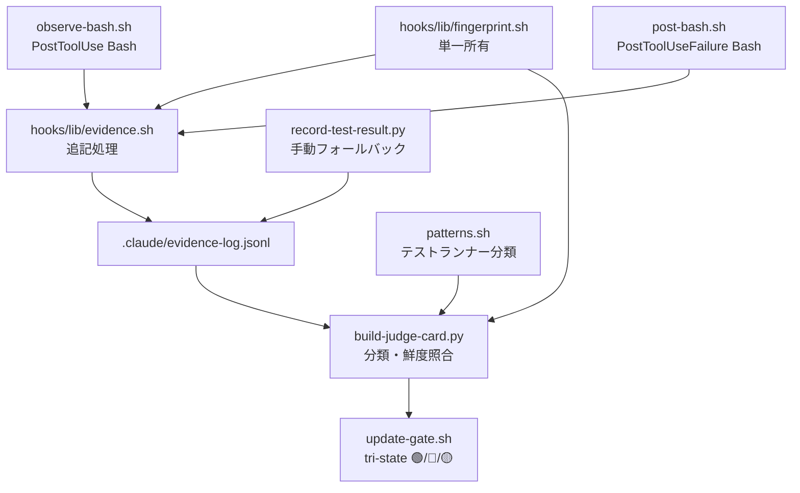

# ブレインストーミング記録
<!-- 正本: brainstorming skill -->

## 日付

- 2026-06-10

## テーマ

- E1: 検証の実行ベース化（activity verification）— エージェントの「検証した」という主張ではなく、hook が観測したツール実行の痕跡と突合する

## コンテキスト

- 現在の状況: v1.4.0 リリース済み。tier-2 エビデンス（test-result.json 等）は自己申告（エージェントが自分で書く）のままで、独立検証が未達（進化レビュー §2.2 P1 残課題）
- きっかけ: `docs/evolution-review-2026-06-10.md` §5 E1（最優先推奨）・§6 ロードマップ 5 番。Fable 5 世代の「検証したと偽る」失敗モードへの harness 側の正攻法

## 検討したアプローチ

### アプローチ A: 観測一本化（judge card のテスト行を観測ログ読みに置換）

- 概要: PostToolUse/PostToolUseFailure(Bash) で全 Bash 実行のメタを `.claude/evidence-log.jsonl` に記録し、judge card のテスト判定ソースを観測ログに置換。`record-test-result.py` は同一スキーマの手動フォールバック書き手に改修
- 利点: 自己申告ファイルが信頼チェーンから消える。エージェントは普通にテストを実行するだけで証拠が残る。読み経路1本＝emit.sh 単一出力源の哲学と整合
- 欠点: judge card 改修で既存テストに波及。全 Bash 発火のため記録コスト設計（fingerprint 軽量化）が必要

### アプローチ B: 並列 verifier

- 概要: judge card 不変のまま `scripts/verify_activity.py` を新設し、update-gate が承認時に並走実行
- 利点: 既存 judge card に手を入れず回帰リスク最小
- 欠点: テスト検証経路が2本併存し判定齟齬の所在が曖昧。同期先が増え「単一出力源」哲学に逆行

### アプローチ C: 観測ログ基盤のみ先行

- 概要: 記録だけ実装し照合は次版
- 利点: 最も安全
- 欠点: v1.5.0 としての moat が薄い（強制点がなければ自己申告問題は残置）

## 決定

- 採用アプローチ: A（観測一本化）
- 採用理由: (1) tier-2 自己申告の正面解＝エージェントが証拠ファイルを書く構図を消す。(2) 読み経路一本化が哲学（保証=決定論／単一出力源）に整合。(3) record-test-result.py を同スキーマ書き手として残すことで Claude Code 外実行の死角も塞がる
- 不採用理由: B は検証経路の二重化、C は強制点の欠如

## 設計判断（質問ベースで確定）

| 論点 | 決定 |
|------|------|
| 強制点 | ゲート承認時（update-gate / judge card）を本丸。TaskCompleted は軽い存在チェックのみ |
| 記録範囲 | 全 Bash 実行のメタ（コマンド・成否・時刻・出力ハッシュ・fingerprint）。出力本文は保存しない。記録時のパターン判定を排除（判定漏れ＝証拠消失の死角を作らない） |
| 必須検証の定義 | テストクラス固定で開始。分類パターンは patterns.sh に隔離。宣言式マニフェストは不採用（過去セカンドオピニオンの「manifest=第3同期先」P1 指摘と整合） |

## 構造マップ

## スコープ境界

- やること: 観測フック新設・evidence-log・fingerprint lib・judge card 置換・record-test-result.py 改修・TaskCompleted 存在チェック・setup.sh 配布＋scaffold smoke 拡張・failure policy 表追記・ローテーション
- やらないこと: テスト以外の検証クラス（contract/drift 等）の必須化、宣言式マニフェスト、TaskCompleted での完全照合、ログの意味解析（LLM 判断は reviewer の責務のまま）

## 未解決事項

- grill 🟢4件（v140-security.md 記録済み）の同梱可否は plan フェーズで判断（同領域: patterns.sh / update-gate に触るため）

## 次のステップ

- [x] 設計ノートを作成する → `docs/specs/2026-06-10-e1-activity-verification-design.md`
- テンプレート名: `SPEC.template.md`
<!-- exit-check: アプローチ決定・スコープ明確 → design note へ -->
