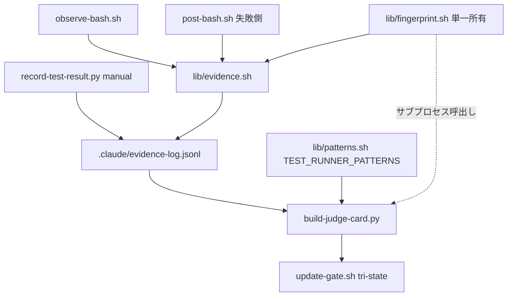

# 設計ノート: E1 activity verification（検証の実行ベース化）
<!-- 正本: brainstorming skill -->

## 入力

- ブレインストーミング記録: `docs/specs/2026-06-10-e1-activity-verification-brainstorm-record.md`
- 要件: `docs/evolution-review-2026-06-10.md`（§2.2 P1 残課題・§5 E1・§6 ロードマップ 5 番）

## 問題整理

- 背景: tier-2 エビデンス（テスト結果等）はエージェントの自己申告ファイルに依存しており、「検証したと偽る」失敗モード（Fable 5 世代で顕在化）に対して非エンジニア judge が無防備
- 判断が必要な論点: 強制点／記録範囲／必須検証の定義／fingerprint の所有者／fail-open/closed の二段構え
- 制約条件: Aegis 哲学（保証=決定論・手順=モデル委譲・揮発値=隔離）、pure-bash 優先（deny 経路の python3 依存禁止）、install 経路の死角を作らない（F6 教訓）、BSD/macOS 互換

## 推奨アプローチ

- 採用方針: 観測一本化。hook が観測した Bash 実行記録（evidence-log）を judge card の唯一のテスト判定ソースにする
- 採用理由: 自己申告ファイルを信頼チェーンから排除し、エージェントの運用コストをゼロにする（普通にテストを走らせるだけで証拠が残る）
- 検討した代替案と不採用理由: brainstorm record 参照（B=経路二重化、C=強制点欠如）

## コンポーネント分解

- 分割方針: 書き手3系統（観測成功・観測失敗・手動）→ 追記 lib 1本 → 読み手1本（judge card）
- 各ユニットの責務:
  - `hooks/observe-bash.sh`（新規・PostToolUse/Bash）: 成功実行を evidence.sh 経由で記録。観測専用＝常に emit_allow
  - `hooks/post-bash.sh`（改修・PostToolUseFailure/Bash）: 既存の ReAct 提案に加え、失敗実行を `status:fail` で記録
  - `hooks/lib/evidence.sh`(新規): スキーマ組立・JSON エスケープ・追記。壊れた入力は dump & continue（`.task-event-debug.log` と同パターン）
  - `hooks/lib/fingerprint.sh`(新規・**単一所有**): worktree fingerprint 計算。merge-base 比の変更コードファイル（docs/** 等 NONCODE 除外）の現内容 sha256。サイズ上限超過は `oversize` を返す
  - `hooks/lib/patterns.sh`（改修）: テストランナー分類パターン `TEST_RUNNER_PATTERNS` を追加（揮発値の隔離）
  - `scripts/build-judge-card.py`（改修）: `read_test_result()` を evidence-log リーダーに置換。分類は patterns.sh を `source` 出力経由で取得、fingerprint 比較は fingerprint.sh をサブプロセス呼出し（**bash/python 二重実装によるハッシュ drift を構造的に排除**）
  - `scripts/record-test-result.py`（改修）: テストを信頼実行し evidence-log へ `src:"manual"` で追記。`test-result.json` 書込は廃止
  - `hooks/check-task-completed.sh`（改修）: evidence-log ファイル不在＝観測系死亡の検査（差し戻し exit 2）。空ファイルは pass
  - `hooks/session-start.sh`（改修）: サイズ超過時ローテーション（`.1` 退避＋空ファイル touch）。ファイル存在＝観測系生存の信号
  - `bin/setup.sh`・scaffold smoke（改修）: 新規 hook/lib の配布＋実発火検査（install 経路の契約化）

### アーキテクチャ図



## インターフェース定義

- evidence-log スキーマ（JSONL・1実行=1行）:

  ```json
  {"v":1, "ts":"2026-06-10T12:00:00Z", "src":"observed|manual",
   "cmd":"<先頭500字>", "status":"ok|fail",
   "out_sha":"<出力先頭64KBのsha256>", "fp":"<fingerprint|oversize>"}
  ```

- `fingerprint.sh`: 引数 `<root>` → stdout に fingerprint 文字列（または `oversize`）、rc=0。計算不能は rc≠0（読み手は unverified に倒す）
- `evidence.sh::append_evidence <status> <input-json>`: hook stdin の tool_input/tool_response からメタを抽出し追記。失敗しても rc=0（観測専用・本体を止めない）
- judge card テスト行の判定関数: evidence-log（current＋直近 `.1`）を新しい順に走査し、`TEST_RUNNER_PATTERNS` 一致の最新エントリで判定

## データフロー / 構造

- 入力: hook stdin（PostToolUse/PostToolUseFailure ペイロード）、evidence-log、現 worktree
- 処理: 記録（分類なし・全実行）→ 承認時に分類＋鮮度照合
- 出力: tri-state 判定
  - `status:ok` ＋ fp 現コード一致 → **green 🟢**
  - `status:fail` ＋ fp 現コード一致 → **red 🔴**（ハードブロック・現行踏襲）
  - 記録なし／fp 不一致／oversize／読取不能 → **unverified 🟡**（`--ack` 可・現行踏襲）

## 依存関係

- 依存方向: observe-bash / post-bash / record-test-result → evidence.sh → fingerprint.sh（循環なし）。build-judge-card → patterns.sh / fingerprint.sh（読み専用）
- 外部依存: git・shasum（BSD/macOS 同梱）。記録経路に python3 依存なし（pure-bash）。読み手（judge card）は既存どおり python3

## エラーハンドリング

- 想定失敗: ペイロード解析不能／fingerprint 計算不能／ログ書込不能／ログ破損行
- 対応: 記録側はすべて dump & continue（fail-open）。読み手は破損行 skip・読取不能は unverified（silent-green なし）
- エラー伝播の方針: **記録=fail-open／判定=fail-closed の二段構え**。記録の欠落は隠れず、ゲートで 🟡 unverified として表面化する。`docs/hook-failure-policy.md` に observer 行を追記し実発火突合テストで固定
- 観測系死亡の可視化: evidence-log ファイル不在を TaskCompleted で差し戻し（CLAUDE_PROJECT_DIR 未設定系の silent fail-open 同族対策）

## テスト戦略

- 単体: evidence.sh（追記・エスケープ・壊れ入力 dump）／fingerprint.sh（決定性・docs 除外・oversize・BSD sed/shasum）／judge card 判定マトリクス（ok/fail/なし × fp 一致/不一致/oversize）
- 結合: hook 実 stdin 発火（observe-bash・post-bash 失敗側・check-task-completed 不在検査）／update-gate 承認フローでの tri-state 表示
- エッジケース: ローテーション直後（`.1` 読み）／巨大 diff／evidence-log 破損行混入／manual と observed の混在（最新優先）
- 手動確認: scaffold install 先で observer 実発火 → ゲート承認 → judge card 表示（smoke 拡張で自動化）

## 規模・版数

- task_size: **L**（hooks×4・lib×3・scripts×2・setup/smoke/templates/gitignore/docs 横断 14+ ファイル）→ 全ゲート対象
- 版数: **v1.5.0**（minor）。`test-result.json` 廃止は内部機構の置換（公開契約=運用契約は不変）

## スコープ外（明示）

- テスト以外の検証クラス（contract/drift/smoke）の必須化
- 宣言式マニフェスト（gate→検証クラス対応の設定ファイル）
- TaskCompleted での完全照合
- ログの意味解析（LLM 判断は reviewer の責務のまま）

## 次のステップ

- [ ] 実装計画を作成する → `docs/plans/2026-06-10-e1-activity-verification-implementation-plan.md`
- テンプレート名: `PLAN.template.md`
- 本設計ノートのパスを PLAN の「参照設計」に記載すること
- grill 🟢4件の同梱可否を plan で判断
<!-- exit-check: 全セクション記入・自己レビュー完了 → plan へ -->
