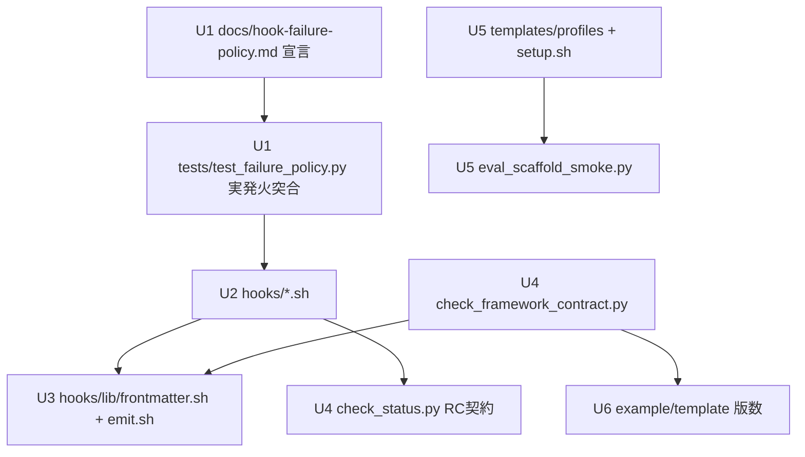

# 設計ノート
<!-- 正本: brainstorming skill -->

## 入力

- ブレインストーミング記録: docs/specs/2026-06-10-v140-fix-batch-brainstorm-record.md
- 要件: docs/evolution-review-2026-06-10.md §4（P2/P3/K-2）・構造的観察 3/4、docs/LEARNINGS.md:37（B1 恒久対応候補）

## 問題整理

- 背景: 進化レビューの P2×6（silent degradation）・P3×6（軽微）・K-2 が未修正。根は「hook の failure 時方針（fail-open/closed）がアドホックで宣言されていない」こと（構造的観察 3）と「task_size skip の意味論混同」（同 4）。加えて B1 テスト強度ドリルが framework 混在 diff に構造的に適用不能（LEARNINGS:37）。
- 判断が必要な論点: ポリシー宣言の置き場と執行方法／size-skip の意味論／版数 — いずれも brainstorm record のサブ決定で確定済み。
- 制約条件:
  - emit.sh 系 hook は pure-bash（外部依存ゼロ）を維持する
  - 正規表現は POSIX ERE 互換（GNU/BSD grep 双方で同挙動）
  - macOS に flock(1) が無い → ロックは mkdir 方式
  - examples/minimal-project/hooks/ は byte-identical mirror（hook 変更は必ず同期）
  - 公開契約は運用契約のみ（SemVer）。本バッチは minor（v1.4.0）

## 推奨アプローチ

- 採用方針: 「ポリシー表を宣言の単一ソースとして新設し、全 finding 修正をその執行として一括実施」。docs/hook-failure-policy.md に全 hook の failure 時挙動を宣言し、tests/test_failure_policy.py が表をパースして実発火で突合。個別修正（P2/P3）は表が宣言する原則（moat 系=closed／advisory 系=open／size-skip=ask）への是正として行う。
- 採用理由: 宣言と実態の乖離（F6 同型）をテストが恒久に締める。修正が原則の適用になるため一貫性が保たれる。
- 検討した代替案と不採用理由: brainstorm record 参照（2 分割案・E1 先行案・machine-readable 案・deny 案・現状維持案）。

## ポリシー原則（docs/hook-failure-policy.md の骨子）

| 分類 | 対象 hook | 依存不在時 | 入力パース失敗時 |
| --- | --- | --- | --- |
| moat（ゲート・破壊防止・秘密・完了強制） | check-gate / check-tdd / check-client-info / check-destructive / check-secrets / check-deploy-gate / check-deploy-mcp-gate / check-skill-gate / check-cron-gate / check-control-plane / check-task-created / **check-task-completed（open→closed に是正）** | **fail-closed**（明示メッセージで deny） | allow（入力不明では誤 deny を避ける。現状維持） |
| advisory（可視化・補助） | post-bash / post-status-audit / pre-compact / session-start | fail-open | allow |
| size-skip（task_size S/M の deploy） | check-deploy-gate 経由 | — | — → **ask**（無検査許可を人間確認に是正） |

## コンポーネント分解

- 分割方針: 「宣言と執行（U1）」を核に、修正対象を層（hooks／lib／scripts／templates・profiles／docs）ごとのユニットに分ける。
- 各ユニットの責務:
  - **U1 ポリシー宣言＋執行**: `docs/hook-failure-policy.md`（新設・宣言の単一ソース）＋ `tests/test_failure_policy.py`（新設・Markdown 表をパース→各 hook を依存隠蔽環境で実発火→宣言と突合）
  - **U2 hooks 修正**:
    - `check-deploy-gate.sh`: DEPLOY_RE 拡大（`vercel --prod` 等オプション付き形・`wrangler deploy|publish`）／check_status.py の RC=2 を emit_ask にマップ／python3 不在時 emit_deny（closed 化）
    - `check-task-completed.sh`: python3 不在時 emit_deny（closed 化、check-task-created と対称に）
    - `check-secrets.sh`: `id_ed25519`・`id_ecdsa`（各 .pub 含む）を全 3 箇所（HIGH_RISK_RE／case 文／:99）に追加
    - `check-control-plane.sh`: WRITE_INDICATORS の `remove` 等を語境界付き POSIX ERE に（P3-4）
    - `pre-compact.sh`: `AEGIS_PRECOMPACT_INTERVAL` へ改名、旧 `ULTRA_PRECOMPACT_INTERVAL` は fallback で読む（P3-2）
  - **U3 lib 追加**: `hooks/lib/frontmatter.sh` 新設（`read_frontmatter <file>` ＝ 先頭 `---`〜`---` 範囲を全行出力）。`grep -A20` の 5 箇所（check-gate.sh:127／post-status-audit.sh:53,96／check-task-created.sh:90／session-start.sh:48／scripts/update-gate.sh:38,81,220）を置換（P3-5）
  - **U4 scripts 修正**:
    - `check_status.py --check-deploy-ready`: S/M（SIZE_ALLOWED_PHASES に deploy 無し）で `return 0` → **`return 2`**（ask、確認メッセージを stdout に出力）（P2-3）
    - `update-gate.sh`: mkdir ロック（取得失敗は短リトライ→明示エラー）＋ 2 回の sed/mv 書き込みを 1 パス化（P3-3）
    - `check_framework_contract.py`: REQUIRED_HOOK_FILES に `hooks/lib/emit.sh`・`hooks/lib/patterns.sh` を追加（P2-5）／「example・template の framework_version == FRAMEWORK_VERSION」検証を追加（P2-6 再発封鎖）
    - `run-test-strength-drill.py`: `docs/` prefix を mutant 生成と coverage floor の両方から除外（DRILL_ARTIFACT_PREFIX と同型の定数）（B1）
  - **U5 templates / profiles / setup**:
    - `templates/profiles/standard.json`: hooks_include に Bash ガード 4 種（check-destructive / check-secrets / check-deploy-gate / check-control-plane）を追加。check-tdd は full 限定のまま（P2-1）
    - `templates/hooks.template.json`: command を `"$CLAUDE_PROJECT_DIR"/hooks/<name>.sh` 形式へ（P3-6）。`bin/setup.sh` generate_settings のスクリプト名抽出（`/` split）を新形式に追従
    - `scripts/eval_scaffold_smoke.py`: 「生成 settings の全 command が `$CLAUDE_PROJECT_DIR` 参照」「standard install で check-destructive が実発火」を検証に追加
  - **U6 docs**:
    - `examples/minimal-project/docs/STATUS.md`・`templates/STATUS.template.md` の framework_version を 1.4.0 へ（P2-6）
    - `docs/functional-integrity-audit-report-2026-06-07.md` の重複「Layer 3」節（:316 付近）削除（K-2）
    - README に v1.4.0 移行節（standard の guard 追加・deploy gate 厳格化・env var 改名）
    - `docs/LEARNINGS.md:37` の B1 エントリに恒久対応済みの追記
    - hooks 変更の example mirror 同期

### アーキテクチャ図

## インターフェース定義

- ユニット間の契約:
  - `check_status.py --check-deploy-ready` → `check-deploy-gate.sh`: exit 0 = allow／**exit 2 = ask（確認メッセージは stdout）**／その他非 0 = deny（理由は stdout）。
  - `check-deploy-gate.sh` → Claude Code: RC=0 → emit_allow、RC=2 → emit_ask、他 → emit_deny。python3 実行不能時は emit_deny（ポリシー表 moat 分類）。
  - `read_frontmatter <file>`（hooks/lib/frontmatter.sh）: stdout = frontmatter 本文全行（区切り `---` は含まない）、frontmatter 不在時は空出力＋RC 非 0。呼び出し側は従来の `grep -A20` パイプ位置に差し替え。
  - `tests/test_failure_policy.py` ⇄ `docs/hook-failure-policy.md`: 表の列契約 = hook 名／分類（moat・advisory）／依存不在時挙動／パース失敗時挙動。表パース失敗・hook の過不足はテスト FAIL（表が陳腐化したら落ちる）。
- 公開 API（運用契約の変更点 = minor の根拠）:
  - standard プロファイルの hook 構成（Bash ガード 4 種追加）
  - deploy gate のマッチ範囲拡大と S/M の ask 化
  - env var `AEGIS_PRECOMPACT_INTERVAL`（旧名は 1 リリース間 fallback）

## データフロー / 構造

- 入力: hook stdin（実運用スキーマ JSON）／docs/STATUS.md frontmatter／プロファイル JSON
- 処理: hook → lib（extract-input / emit / frontmatter）→ 必要時 check_status.py 委譲 → allow/ask/deny JSON
- 出力: Claude Code hook 決定 JSON（emit.sh 単一出力源は不変）

## 依存関係

- 依存方向: U2 hooks → U3 lib → なし／U2 → U4 check_status.py（deploy gate のみ）／U5 setup → templates。循環なし。
- 外部依存: python3（moat 系 hook は不在時 fail-closed と宣言・執行）。emit.sh／frontmatter.sh は pure-bash。

## エラーハンドリング

- 想定失敗: python3 不在（moat 系 = deny・advisory 系 = allow をポリシー表通りに）／hook 入力パース失敗（allow、現状維持）／update-gate の並行実行（mkdir ロック取得失敗 → 短リトライ → 明示エラーで中断、部分書き込みなし）／frontmatter 不在（read_frontmatter RC 非 0 → 呼び出し側は従来の「情報なし」分岐に流す）。
- 対応: 全 deny/ask は emit.sh 経由で理由文字列を返す（無言ブロックなし）。
- エラー伝播の方針: hook 内部エラーは決定 JSON に変換して exit 0（Claude Code への異常 RC 漏れを避ける、現行設計踏襲）。

## テスト戦略

- 単体（TDD・RED→GREEN）:
  - DEPLOY_RE: `vercel --prod`・`npx vercel --prod`・`wrangler deploy` がマッチ、`my-vercel`・`vercel env ls`・`rg deploy` が非マッチ
  - check_status.py: S/M ＋ deploy コマンド → exit 2、L → 従来 deny/allow 不変
  - check-secrets: id_ed25519／id_ecdsa（+.pub）検出
  - WRITE_INDICATORS: `grep -r "remove"` 偽陽性解消・真陽性（`rm`・`sed -i` 等）維持
  - frontmatter.sh: 20 行超 frontmatter／frontmatter 不在／本文に `---` を含むケース
  - run-test-strength-drill.py: docs/ ハンクが mutant・floor から除外（tests/test_test_strength_drill.py 拡張）
  - update-gate.sh: ロック下の直列化（並行 2 プロセスで lost update なし）
- 結合:
  - tests/test_failure_policy.py: 表駆動で全 hook を依存隠蔽 PATH 下で実発火し宣言と突合
  - contract: lib 2 ファイル追跡・example/template 版数同期・mirror byte-identical
  - scaffold smoke: standard install で check-destructive 実発火／生成 settings の `$CLAUDE_PROJECT_DIR` 参照
- エッジケース: gate_approvals が 20 行超の STATUS.md（P3-5 の動機）／オプション挟み deploy コマンド／旧 env var fallback
- 手動確認: なし（テスト＋smoke で完結）

## 次のステップ

- [ ] 実装計画を作成する → `docs/plans/2026-06-10-v140-fix-batch-implementation-plan.md`
- テンプレート名: `PLAN.template.md`
- 本設計ノートのパスを PLAN の「参照設計」に記載すること
<!-- exit-check: 全セクション記入・自己レビュー完了 → plan へ -->
