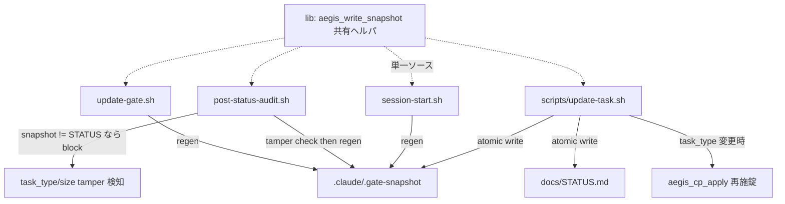

# ブレインストーミング記録
<!-- 正本: brainstorming skill -->

## 日付

- 2026-06-24（iteration 43）

## テーマ

- I3: `task_type` / `task_size` の tamper-evidence（SF-006・full-review I3）

## コンテキスト

- 現在の状況: Aegis の STATUS.md はセキュリティ制御面（gate 要件・moat lock を決定）でありながら自由 Edit 可能なドキュメントでもある。gate / phase / mode は `.claude/.gate-snapshot` ＋ `post-status-audit.sh` で tamper-evident（無許可変更は block）。一方 `task_type` / `task_size` は snapshot にも監査にも含まれない。
- きっかけ: full-review 2026-06-24（I3）。単一 Edit `task_type: framework→bugfix` で layer-1（check-gate allowlist）と layer-2（`aegis_cp_apply` の OS chmod 再施錠）が同時解錠し、`task_size: L→S` で必須 gate（deploy 等）が要件から外れる。
- 脅威モデル（明示）: **これは「LLM の自己バイパス」に対する tamper-evidence であり、外部 adversary 対策ではない。** 事故では task_type を書き換えない。守る相手はタスク遂行中の LLM が規律を回避するショートカット（例: 「この gate 面倒だから S 扱いでいいか」）。gate snapshot/audit が存在する理由と同一クラスの動機。

## 検討したアプローチ

### アプローチ A: 新規 `scripts/update-task.sh`（authorized write-path）

- 概要: update-gate.sh と同型の専用スクリプトを新設。`task_type` / `task_size` の変更を STATUS.md ＋ snapshot にアトミックに反映。Bash 経由実行のため post-status-audit を自然にバイパス。raw Edit は post-status-audit が block。
- 利点: task_type（rollover でのみ正当変更）と task_size（plan で確定＝mid-iteration 変更）の**異なる変更ウィンドウ**を1本で扱える。update-gate.sh という既存・理解済みパターンの踏襲＝作者の保守性が高い。関心分離が明確。
- 欠点: 新スクリプト1本＋skill/docs 改訂が増える。snapshot 書き手が3→4箇所に増える（ドリフト懸念→共有ヘルパで対処）。

### アプローチ B: `update-gate.sh` を拡張

- 概要: 既存 update-gate.sh に task サブコマンドを追加。
- 利点: 新ファイルを作らない。
- 欠点: update-gate.sh は345行・精緻なロック機構を持つ。gate と task という別関心を混在させると複雑度が増し保守性が下がる。grill の「half-measure を排除しつつ肥大化も避ける」に反する。

### アプローチ C: iteration インクリメント時のみ task_type/task_size 変更可

- 概要: 新スクリプトを作らず、post-status-audit で「iteration が増えた時だけ task_type/size の変更を許可」と判定。
- 利点: 新スクリプト不要。
- 欠点: **task_size は brainstorm→plan で初めて確定する**（scope を探る前にサイズは決まらない）。iteration 増分時（=rollover）に size 確定を強制すると有害なワークフロー変更になる。task_type には合うが task_size に合わない＝両者を1機構で扱えない。

## 決定

- 採用アプローチ: **A（新規 `scripts/update-task.sh`）**
- 採用理由: task_type と task_size は正当な変更タイミングが異なる（rollover vs plan）。両者を素直に扱え、既存 update-gate.sh パターンを踏襲できる A が作者保守性で最良。
- 不採用理由: B=別関心の混在で複雑化。C=task_size の mid-iteration 確定という現行（かつ正しい）ワークフローと両立しない。

## 構造マップ

## スコープ境界

- やること:
  1. `scripts/update-task.sh` 新設（enum 検証のみ＝lean／STATUS+snapshot アトミック書込み／既存 gate-update ロック共有で STATUS 同時書込み直列化／task_type 変更時 `aegis_cp_apply`）。
  2. snapshot スキーマに `task_type` / `task_size` 追加。書き手を共有ヘルパ `aegis_write_snapshot` に集約（session-start / post-status-audit / update-gate / update-task の4経路）。
  3. post-status-audit に task_type/task_size の tamper 検知（block・gate ループ踏襲）。**`aegis_cp_apply` を tamper チェック後へ移動**（改竄編集が解錠する前に block）。
  4. ワークフロー docs: rollover と aegis-brainstorm Step D を update-task.sh 経由に。CLAUDE.md / state-machine に authorized-path 明記。
  5. tests（RED-first）: 正当変更 pass／raw Edit block／snapshot スキーマ／cp_apply 順序／ロック共有。
- やらないこと:
  - update-task.sh に enum 以上の validation を盛らない（shrink 禁止・phase 連動は YAGNI）。
  - warn 止まりにしない（block 一択＝非対称解消の一貫性）。
  - check-control-plane（moat 本体）の再設計（RC-1 の結論）。
  - 外部 adversary 対策の拡張（脅威モデル外）。

## 未解決事項

- 共有ヘルパ `aegis_write_snapshot` を新 lib にするか既存 lib に足すかは plan で確定。
- update-task.sh のロックを update-gate.sh と完全共有（同一ロックディレクトリ）するか、ロックヘルパを抽出するかは plan で確定（STATUS 同時書込みの直列化が目的）。

## 次のステップ

- [x] 設計ノートを作成する → `docs/specs/2026-06-24-iter43-task-tamper-evidence-design.md`
- テンプレート名: `SPEC.template.md`
<!-- exit-check: アプローチ決定・スコープ明確 → design note へ -->
