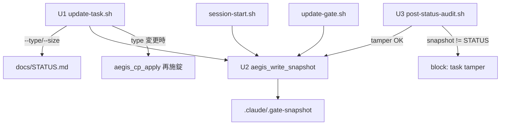

# 設計ノート
<!-- 正本: brainstorming skill -->

## 脅威モデル（GO 条件・冒頭明記）

本機能は **LLM の自己バイパス（self-bypass）に対する tamper-evidence** である。外部 adversary 対策ではない。

- 守る対象: タスク遂行中の LLM が規律を回避するショートカット（例: 必須 gate を避けるため `task_size: L→S`、moat を緩めるため `task_type: framework→bugfix`）。
- 守らない対象: スクリプトを直接呼べる/OS ツールを使える determined adversary（SF-004 と同クラス＝受容済み）。事故（task_type を誤って書き換える）も対象外＝発生しない。
- 価値: gate-advancement は tamper-evident なのに、**その gate の要件と moat lock を決定する変数（task_type/task_size）が無監査**という非対称を解消する。鍵をかけたドアの横の開いた窓を塞ぐ。
- 残存（受容）: PostToolUse の block はディスクの編集を巻き戻さない。改竄値が STATUS に残れば次回 session-start が snapshot を再生成し事実上 bless する（**cross-session re-bless**）。これは gate tamper と同一クラスの既存性質。本 fix の達成範囲は「当該セッション内で moat 解錠前に block」まで。これ以上（編集の巻き戻し）は PostToolUse の仕組み上不可＝tamper-evidence であって proof ではない。

## 入力

- ブレインストーミング記録: `docs/specs/2026-06-24-iter43-task-tamper-evidence-brainstorm-record.md`
- 要件: `docs/full-review-2026-06-24-hooks-gates-distribution.md`（I3 / SF-006 / RC-1）

## 問題整理

- 背景: `hooks/post-status-audit.sh` は `.claude/.gate-snapshot` と STATUS.md を比較し gate/phase/mode の無許可変更を block する。snapshot には gate_approvals・phase・mode のみが入る。`task_type`/`task_size` は snapshot にも tamper チェックにも含まれない。
- 論点: (i) authorized write-path を新スクapplication(update-task.sh) にするか／(ii) snapshot 書き手の重複（3→4）をどう抑えるか／(iii) `aegis_cp_apply`（task_type 連動の moat 再施錠）の実行順序。
- 制約条件:
  - chicken-and-egg: I3 実装後は rollover / aegis-brainstorm の raw Edit による task_type/size 変更が自分でブロックされる→ authorized-path が前提。
  - task_size は plan で確定（mid-iteration 変更が正当）。task_type は rollover でのみ正当変更。
  - moat 本体（cp-lock.sh の find -exec chmod・iter40）は変更しない。
  - PostToolUse の「block」はファイル編集を巻き戻さない＝tamper-evidence であって tamper-proof ではない（gate と同じ性質）。

## 推奨アプローチ

- 採用方針: **新規 `scripts/update-task.sh`** を唯一の authorized write-path とし、snapshot に `task_type`/`task_size` を追加、post-status-audit に tamper 検知を追加、snapshot 書込みを共有ヘルパに集約。
- 採用理由: task_type/task_size の正当変更ウィンドウが異なるため両者を素直に扱え、既存 update-gate.sh パターンの踏襲で作者保守性が高い（North Star）。
- 検討した代替案と不採用理由: B（update-gate.sh 拡張）＝別関心の混在で複雑化。C（iteration 連動のみ許可）＝task_size の mid-iteration 確定と非両立。

## コンポーネント分解

- 分割方針: 「authorized writer（スクリプト）」「tamper detector（hook）」「snapshot 書込み（共有ヘルパ）」を分離。
- 各ユニットの責務:
  - **U1 `scripts/update-task.sh`**: 引数 `--type <t>` / `--size <s>`（各任意・少なくとも一方必須）。enum 検証（ALLOWED_TASK_TYPES / ALLOWED_TASK_SIZES）。STATUS.md の該当行を更新し snapshot を再生成（共有ヘルパ）。task_type 変更時のみ `aegis_cp_apply` で moat を再施錠。STATUS 同時書込みを避けるため update-gate.sh と同一ロックを取得。
  - **U2 共有ヘルパ `aegis_write_snapshot <root>`**: STATUS.md から gate_approvals 節 ＋ phase ＋ mode ＋ **task_type ＋ task_size** を読み、`.claude/.gate-snapshot` にアトミック書込み（tmp→mv）。session-start / post-status-audit / update-gate / update-task の4経路が呼ぶ。
  - **U3 post-status-audit 拡張**: gate ループの後に task_type/task_size 比較ループを追加（snapshot != STATUS かつ snapshot 側が非空 → block）。`aegis_cp_apply` 呼出を tamper チェック後（snapshot 再生成の直前）へ移動。

### アーキテクチャ図



## インターフェース定義

- U1 CLI: `bash scripts/update-task.sh [--type <feature|refactor|bugfix|hotfix|framework>] [--size <S|M|L>]`
  - 0: 成功（変更を STATUS+snapshot に反映）。非0: enum 不正 / 引数なし / ロック取得失敗 / STATUS 不在。
- U2: `aegis_write_snapshot <root>` → `.claude/.gate-snapshot` を書く。戻り値は best-effort（失敗時も非破壊／既存 snapshot を残す）。
- U3: post-status-audit が STATUS 編集時に発火。task tamper 検知時は `{"decision":"block","reason":"[task-tamper] ..."}`。

## データフロー / 構造

- snapshot 形式（拡張後）:
  ```
  gate_approvals:
    <gate>: <value>   (各 gate)
  phase: <phase>
  mode: <mode>
  task_type: <type>
  task_size: <size>
  ```
- 正当変更フロー: LLM が `bash scripts/update-task.sh --size M` 実行 → STATUS 更新 ＋ snapshot 更新（両者一致）→ 後続の STATUS 編集で post-status-audit が一致を確認し block しない。
- 改竄フロー: LLM が STATUS の `task_size: L` を raw Edit で `S` に → post-status-audit 発火 → snapshot(L) != STATUS(S) → block（`aegis_cp_apply` 到達前）。

## 依存関係

- 依存方向: update-task.sh → U2 ヘルパ → frontmatter.sh（読取）。post-status-audit → U2 ヘルパ。循環なし。
- 外部依存: なし（pure-bash／既存 lib のみ）。scripts は既に hooks/lib/frontmatter.sh を source する前例あり（update-gate.sh:19）。

## エラーハンドリング

- 想定失敗と対応:
  - enum 不正引数 → update-task.sh が非0で拒否（変更しない）。
  - STATUS 不在 → 非0 で拒否。
  - ロック競合（update-gate.sh と同時）→ 既存ロック機構で直列化／タイムアウトで非0。
  - snapshot に task_type/task_size が無い旧形式（移行猶予）→ post-status-audit は snapshot 側が空なら block せず再生成（gate ループの `[ -n "$OLD" ]` と同方針）。
  - task_size は STATUS で null 許容＝空同士の比較は no-op。
- エラー伝播の方針: hook は fail-closed（I1 の safety fallback を踏襲）。スクリプトは set -euo pipefail。

## テスト戦略（RED-first）

- 単体（update-task.sh）:
  - `--type framework` / `--size M` が STATUS と snapshot を一致更新する。
  - enum 不正（`--size XL` / `--type foo`）を拒否し STATUS を変更しない。
  - 引数なしは usage を出し非0。
  - task_type 変更で `aegis_cp_apply` が呼ばれ moat 状態が切替わる（framework=lock / bugfix=unlock）。
- 結合（post-status-audit）:
  - raw Edit による `task_size: L→S` を block する（RED: 現状は通る）。
  - raw Edit による `task_type: framework→bugfix` を block する（RED）。
  - update-task.sh 経由の変更は後続編集で block されない（GREEN path）。
  - 改竄編集時に `aegis_cp_apply` が解錠する前に block される（順序）。
  - snapshot に task_type/task_size 行が含まれる（スキーマ）。
- エッジケース: 旧形式 snapshot（task_type 行なし）での移行猶予／task_size null／update-gate.sh と update-task.sh の連続実行で snapshot が両フィールド保持。
- 手動確認: full suite green ＋ `git status --porcelain` クリーン（moat の mode-flip 検出）＋ contract PASS ＋ status_doctor PASS。
- 罠（既知）: hook が新 lib を source したら test scratch（TempProjectWithHooks 等）にも同 lib を追加（iter36/39/42 class）。

## 次のステップ

- [ ] 実装計画を作成する → `docs/plans/2026-06-24-iter43-task-tamper-evidence-implementation-plan.md`
- テンプレート名: `PLAN.template.md`
- 本設計ノートのパスを PLAN の「参照設計」に記載すること
<!-- exit-check: 全セクション記入・自己レビュー完了 → plan へ -->
