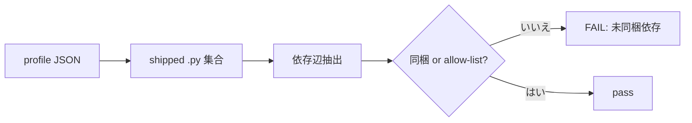

# 設計ノート
<!-- 正本: brainstorming skill -->

## 入力

- ブレインストーミング記録: `docs/specs/2026-06-26-distribution-self-containment-brainstorm-record.md`
- 要件: `docs/requirements/iter48-distribution-self-containment.md`

## 問題整理

- 背景: 各 profile（minimal/standard/full）の「shipped .py スクリプトが実行時に参照する
  兄弟スクリプト依存が同梱されているか」を横断検査する仕組みが無い。網の隙間から、
  D5（version-drift 警告）と JNY-07（client gate テンプレ位置ヒント）が現場でサイレント死。
- 判断が必要な論点:
  1. 検査する参照辺の射程（YAGNI 線）。
  2. 各穴を「ship（同梱）」で直すか「allow-list（意図的非同梱を明記）」で通すか。
  3. 「shipped」の定義（required ∪ recommended か required のみか）。
- 制約条件:
  - setup.sh は `required` と `recommended` の**両方**をコピーする（Main step 1+2）。
    required/recommended の差は contract 重大度（required 欠落=FAIL / recommended 欠落
    =WARNING）であって「同梱されるか」ではない。
  - LEARNINGS conf8: standard は Dev-lean、Client artifact は full に集約。
  - LEARNINGS conf8: gate-blocking 依存は `required`、graceful-degrade 依存は recommended 可。
  - LEARNINGS conf9: 3 点検証（pytest + check_framework_contract.py + eval_scaffold_smoke.py）。
  - LEARNINGS: profile 件数変更は README（test_readme_profile_counts.py）と同期。

## 推奨アプローチ

- 採用方針: profile ごとに、shipped .py の実行時依存辺を抽出し「同梱 ∨ 理由付き
  allow-list」を恒久検査するテストを 1 本追加。現存 2 穴を RED→GREEN にする。
  - **Fix #1（実修正）**: `_artifact_template_map.py` を **full profile の recommended**
    に同梱（JNY-07 の非エンジニア Client 経路は full にのみ存在）。standard/minimal は
    Dev-lean/core-only で Client 経路を持たないため allow-list（理由明記）。
  - **Fix #2（allow-list）**: `check_framework_contract.py` を full 用 allow-list に
    理由付き登録（maintainer 専用ツールチェーン・field no-op は by-design）。同梱しない
    （依存閉包 platform_manifest+context_budget を install に引きずらない）。
- 採用理由: 実証済み 2 穴を含む CLASS を最小侵襲で恒久封鎖。iter41 D1 の judge toolchain
  依存閉包対処を一般化。
- 検討した代替案と不採用理由:
  - D5 も ship: contract ツールチェーン全体（3+ファイル）を install に同梱する過大コスト。
    D5 の field 価値は構造的に薄い（install 単体は新版を観測不能）。→不採用。
  - 全穴を ship で直す: JNY-07 は ship が正だが D5 は ship が過大。穴ごとに正解が違う
    ため、テストは「ship ∨ allow-list」の二択を許容する設計にする。

## コンポーネント分解

- 分割方針: テスト 1 本（検査ロジック＋allow-list 定数を同居）＋ profile/README の実修正。
  新規の独立モジュール（manifest 等）は作らない（YAGNI・消費者が他にいない）。
- 各ユニットの責務:
  - ユニット A: `tests/test_profile_referential_integrity.py`（新規）
    - 各 profile JSON を読み、shipped scripts（required ∪ recommended のうち
      `scripts/*.py`）を列挙。
    - 各 shipped .py の**実行時依存辺**を抽出（下記「データフロー」）。
    - 各依存が（同 profile に同梱）∨（`INTENTIONAL_UNSHIPPED[profile]` に理由付き登録）
      でなければ FAIL。
    - allow-list の各エントリは非空 reason 文字列必須（サイレント許容を禁止）。
  - ユニット B: `templates/profiles/full.json`
    - recommended に `scripts/_artifact_template_map.py` を追加。
  - ユニット C: `README.md`
    - full profile のファイル件数を +1 同期。

## インターフェース定義

- 依存辺抽出（テスト内ヘルパ `_script_deps`）の契約 — **grill-plan F1 反映: 自動検出**:
  - 入力: shipped .py の絶対パス。
  - 出力: `set[str]`（参照される兄弟スクリプトの rel-path、例 `scripts/_artifact_template_map.py`）。
  - 抽出規則（自動・手動リスト無し）:
    1. static import: ast Import/ImportFrom の module 名が `scripts/<mod>.py` に実在する兄弟のみ。
       try/except 内も**辺として数える**（degrade は壊れないだけで機能は依存同梱で初めて働く）。
    2. dynamic/string: `ast.Constant(str)` の値が `*.py` かつ basename が兄弟 `scripts/<basename>`
       に実在 → 動的辺（importlib・subprocess・string-read を自動捕捉。status_doctor→
       check_framework_contract や build-judge-card→importlib も手書き無しで拾う。ハイフン名
       スクリプトは import 不可視だが string scan で拾える）。
  - bare-expression の文字列（docstring・単独文字列文）は除外（実依存は代入/引数/リスト要素で
    あって裸の文字列文ではない＝docstring 中の `.py` で allow-list を汚さない。review 2次指摘 F1 反映）。
    それ以外の過検出（残余）は **fail-closed**＝allow-list で明示解消（見逃しより過検出を選ぶ）。
- 判定純関数 `_violations(shipped:set, edges:set, allowlist:dict)->list[str]`（F2）:
  - `dep ∉ shipped ∧ (dep ∉ allowlist ∨ allowlist[dep] が空)` を違反として返す。合成入力で単体テスト
    （negative control＝vacuous 封鎖）。
- allow-list の契約:
  - `INTENTIONAL_UNSHIPPED: dict[str, dict[str, str]]`
    = `{ profile_name: { "scripts/<dep>.py": "理由", ... } }`。
  - 例:
    - `minimal`/`standard`: `scripts/_artifact_template_map.py` →
      「Dev-lean/core-only profile は Client workflow を持たず client-gate テンプレ
       ヒントは未使用（LEARNINGS conf8）」。
    - `full`: `scripts/check_framework_contract.py` →
      「contract/version ツールチェーンは maintainer 専用。D5 ドリフトは
       maintainer→install 方向の検査で install 単体は新版を観測不能＝field no-op は
       by-design。依存閉包 platform_manifest+context_budget を install に同梱しない」。

## データフロー / 構造

- 入力: `templates/profiles/{minimal,standard,full}.json` + `scripts/*.py` のソース。
- 処理:
  1. profile を読み shipped = (required ∪ recommended) ∩ `scripts/*.py`。
  2. 各 shipped .py の依存辺を抽出。
  3. 各辺 dep について: `dep ∈ shipped` ∨ `dep ∈ INTENTIONAL_UNSHIPPED[profile]`
     でなければ違反として収集。
  4. allow-list エントリの reason が空なら違反（明示性の強制）。
- 出力: 違反ゼロで pass。違反は「<profile> の <script> が参照する <dep> が未同梱かつ
  allow-list 未登録」の明確メッセージで FAIL。

### フロー図

## 依存関係

- 依存方向: テスト → profile JSON / scripts ソース（読み取りのみ、循環なし）。
- 外部依存: なし（標準ライブラリ json/ast or 正規表現のみ）。import 抽出は `ast` を
  優先（コメント/文字列誤検出を避けられる）。

## エラーハンドリング

- 想定失敗:
  - profile JSON が読めない → テストが明示 FAIL（壊れた配布契約を黙認しない）。
  - shipped .py が disk に無い → 既存 parity/契約テストの範疇だが、本テストでも
    「参照元が存在しない」は無視せず skip 理由を持たない限り辺抽出対象から外さない。
- 対応: FAIL メッセージに profile 名・script・dep・対処（同梱 or allow-list 追記）を含める。
- エラー伝播の方針: fail-closed（判定不能な辺は違反扱いにせず、抽出器が安全側で
  「辺あり」を返す＝見逃しより過検出を選ぶ。過検出は allow-list で明示解消）。

## テスト戦略

- 単体: 抽出器ヘルパに対し「import 辺を拾う」「コメント中の .py を拾わない」
  「allow-list 空 reason を弾く」の正例/負例。
- 結合: 実 profile JSON × 実 scripts に対する横断検査本体（現状 2 穴を含めて GREEN
  に到達することを最終確認。**修正前は JNY-07/D5 で RED** になることを RED-first で実証）。
- エッジケース:
  - try/except import も辺として数える（degrade を「同梱不要」と誤認しない）。
  - 同名衝突（`import json` 等の標準ライブラリ）は兄弟 `scripts/json.py` 不在なので辺に
    ならない（兄弟実在チェックで除外）。
- 手動確認（3 点・LEARNINGS conf9）:
  1. `python3 -m pytest -q`（新テスト含む全 suite）。
  2. `python3 scripts/check_framework_contract.py`（framework-root 専用ロジック）。
  3. `python3 scripts/eval_scaffold_smoke.py`（scaffold 実発火）。
  + full install を tmp に実施し、`_artifact_template_map.py` が同梱され client-gate
    deny にテンプレヒントが出ること、D5 は意図通り field no-op であることを実証。

## 次のステップ

- [ ] 実装計画を作成する → `docs/plans/2026-06-26-distribution-self-containment-implementation-plan.md`
- テンプレート名: `PLAN.template.md`
- 本設計ノートのパスを PLAN の「参照設計」に記載すること
- plan 後に **grill-plan** を必ず挟む（エッジケース・暗黙の前提・YAGNI 違反・3 年後の
  メンテ性）。
