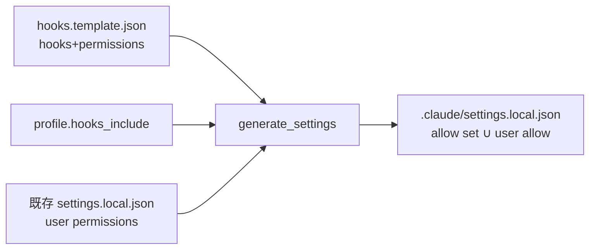

# 設計ノート
<!-- 正本: brainstorming skill -->

## 入力

- ブレインストーミング記録: `docs/specs/2026-06-28-permission-prompt-allowlist-brainstorm-record.md`
- 要件: なし（framework iteration・requirements は暫定 []）

## 問題整理

- 背景: フレームワークが自身の plumbing（診断・テスト・git-read 等）を毎イテレーション多数実行するが、`permissions.allow` がほぼ空のため**毎回 permission プロンプトが出る**。知識の乏しいユーザーには技術的な確認は理解不能で、安全を生まず摩擦だけになる（North Star 違反）。
- 判断が必要な論点: 自動許可の線引き（→ 記録 C で「読み取り/診断＋純記録系のみ・状態変更系はプロンプト維持」に決定）。
- 制約条件:
  - moat（deny/ask hooks＋会話ハードゲート＋judge evidence）を弱めない。
  - allow エントリは**狭く**（プロンプトインジェクション連鎖の面を最小化）。
  - install 実体: テンプレ `permissions` は full のみ同梱・filtered（minimal/standard）で落ちる／merge はユーザ permissions を wholesale 置換。→ 両方修正が必須。
  - 「複雑さは作者保守可能性で判断」＝リスト1本・最小の setup.sh 改変。

## 推奨アプローチ

- 採用方針: 安全な読み取り/診断＋純記録系コマンドの**狭い `permissions.allow`** を**全プロファイル**に同梱する。状態変更系（`update-gate.sh`／`update-task.sh`）と危険系はプロンプト維持。
- 採用理由: 高頻度ノイズの大半を安全に除去でき、deny-hooks と会話ゲートで moat は不変。内部前例（`is_allowlisted`）と外部ベストプラクティス（ゲートは意図的・allow は狭く）の交点。
- 検討した代替案と不採用理由: B（ゲートも自動許可）＝コンセンサス無し・設計反転。A（読み取り専用のみ）＝記録系まで残すのは過保守。D（プロファイル別）＝YAGNI。

## 自動許可する集合（allow set・狭いエントリ）

| コマンド | 種別 | エントリ例 |
|---|---|---|
| `status_doctor.py` | 診断(読) | `Bash(python3 scripts/status_doctor.py:*)` |
| `check_framework_contract.py` | 診断(読) | `Bash(python3 scripts/check_framework_contract.py:*)` |
| `check_status.py` | 診断(読) | `Bash(python3 scripts/check_status.py:*)` |
| `retro_report.py` | 診断(読) | `Bash(python3 scripts/retro_report.py:*)` |
| `build-judge-card.py` | judge プレビュー(読) | `Bash(python3 scripts/build-judge-card.py:*)` |
| `record-test-result.py` | 純記録 | `Bash(python3 scripts/record-test-result.py:*)` |
| `run-test-strength-drill.py` | 純記録 | `Bash(python3 scripts/run-test-strength-drill.py:*)` |
| pytest | テスト | `Bash(python3 -m pytest:*)` |
| git 読み取り | VCS(読) | `Bash(git status:*)` `Bash(git log:*)` `Bash(git diff:*)` |

- **除外（プロンプト維持）**: `update-gate.sh`・`update-task.sh`（意図的チェックポイント）、destructive/secrets/deploy/`git push`（deny/ask hooks がカバー）、チェーン/リダイレクトを含む複合コマンド（settings の狭いパターンに一致せず、かつ hooks が検査）。
- エントリの正確な文字列（`pytest` 直叩きの要否、`python3` パスのバリエーション等）は plan で確定。

## コンポーネント分解

- 分割方針: 「同梱データ（テンプレ）」と「同梱ロジック（setup.sh）」を分離。
- 各ユニットの責務:
  - ユニット A — `templates/hooks.template.json`: `permissions.allow`（上表の集合）を**単一の正本**として保持。
  - ユニット B — `bin/setup.sh:generate_settings()`: (B1) filtered（minimal/standard）分岐でも template の `permissions` を carry する。(B2) 既存ユーザ settings との merge で `permissions.allow` を **wholesale 置換でなく union**（フレームワーク既定＋ユーザ追加の双方を保持・重複排除）。
  - ユニット C — テスト: 全プロファイルの install e2e／union 保全／集合の正しさ／危険系の除外＋hook 健在。

## データフロー / 構造

- 入力: `templates/hooks.template.json`（hooks＋permissions）、profile の `hooks_include`、（再 install 時）既存 `.claude/settings.local.json`。
- 処理: `generate_settings()` が hooks を profile でフィルタしつつ permissions を carry → 既存ユーザの非 hooks キー（permissions/env）と merge（permissions.allow は union）。
- 出力: `.claude/settings.local.json`（profile を問わず allow set を含む・ユーザ追加 allow も保持）。

## 依存関係

- 依存方向: テンプレ（データ）→ setup.sh（ロジック）→ 生成物。循環なし。
- 外部依存: なし（python3 は既存のハード依存）。新規依存ゼロ。

## エラーハンドリング

- 既存 settings が parse 不能: 既存挙動を踏襲（warn＋.bak 退避・ユーザ permissions は carry されない旨を警告）。union はパース成功時のみ。
- profile に permissions が無い/テンプレに無い: 空 allow として扱い、ユーザ既存を保持（fail-safe・no-op）。
- allow に重複: union で重複排除。

## テスト戦略

- 単体: union ロジック（フレームワーク allow ∪ ユーザ allow・重複排除・順序安定）を純関数的に検査。
- 結合（install e2e）: **各プロファイル**で `bin/setup.sh` 実行後、生成 `settings.local.json` に allow set が**全件**含まれること（特に minimal/standard で落ちない＝B1 の回帰）。再 install でユーザ追加 allow が保持され、かつフレームワーク既定が再付与されること（B2）。
- エッジケース: 既存 permissions 無し／既存に同一 allow あり（重複しない）／parse 不能ファイル（warn 経路）／`update-gate.sh` が allow に**含まれない**ことの negative assertion。
- 手動確認: 実 install で読み取り系がプロンプトせず、`update-gate.sh` と破壊的コマンドは依然プロンプト/deny すること（moat 健在）。

## 次のステップ

- [ ] 実装計画を作成する → `docs/plans/2026-06-28-permission-prompt-allowlist-implementation-plan.md`
- テンプレート名: `PLAN.template.md`
- 本設計ノートのパスを PLAN の「参照設計」に記載すること
- plan 確定後に **grill-plan**（タスク#2）を必ず実施
