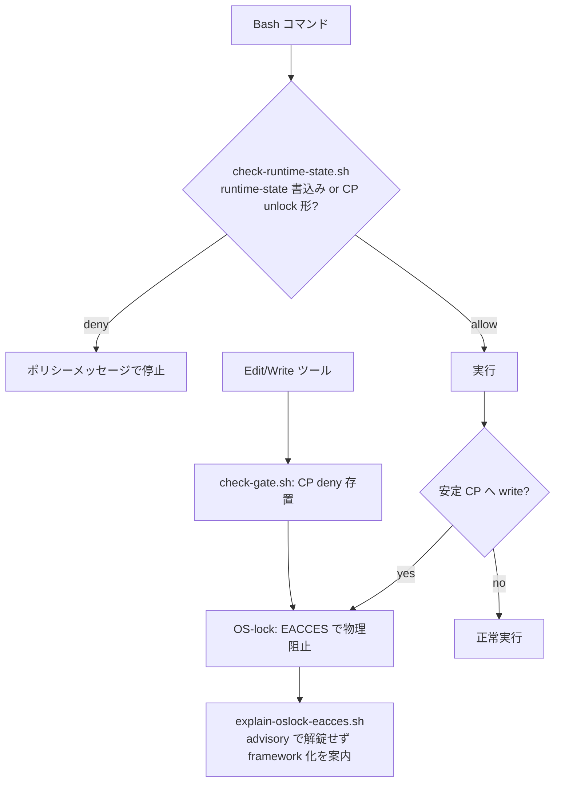

# 設計ノート — iter57 主 moat 交代（OS-lock 昇格・check-control-plane 退役）
<!-- 正本: brainstorming skill -->

## 入力

- ブレインストーミング記録: `docs/specs/2026-07-05-iter57-oslock-promotion-brainstorm-record.md`
- 要件: なし（framework 自己改修）。一次情報＝`docs/security-followups.md`（SF-001〜005・案A PoC）・
  `docs/specs/2026-06-21-immutable-moat-design.md`（rev.2）・徹底グリル 2026-07-02。

## 問題整理

- 背景: 安定 control-plane（hooks/scripts/templates/CLAUDE.md/.claude/{rules,skills,commands,agents}）への
  誤書込み防御が、バイパス実績のある文字列静的解析（979行）を主層とし、構造的に強い OS-lock を
  非致命の従属層に置くという**強弱逆転**の構成になっている。
- 判断が必要な論点: rev.2 撤回理由の再評価（brainstorm 記録で決着済み）・退役後も静的層が必要な残余領域の特定・
  昇格に必要な fail-visible 化の範囲。
- 制約条件: 脅威モデルは事故防止のまま（敵対 sandbox 化しない）。runtime-state
  （`docs/STATUS.md`・`.gate-snapshot`・evidence-log・settings 両方）は lock 対象外を維持
  （ハーネス/framework 自身が実行時に書くため。rev.2 で確定済みの境界）。
  公式サポート = macOS/Linux/WSL（Windows ネイティブは保護なしと明記・ユーザー決定 2026-07-05）。

## 推奨アプローチ

- 採用方針: 一気交代（案A）。cp-lock を主 moat に昇格し、check-control-plane.sh を退役。
  静的層は「lock が物理的に守れない領域」だけに縮退した残余ミニフックとして再構成する。
- 採用理由・代替案: brainstorm 記録の「決定」を参照（rev.2 ①②③の各個撃破）。

## コンポーネント分解

- 分割方針: 「syscall で守れるものは syscall へ、守れないものだけ静的判定に残す」。

- 各ユニットの責務:
  - **`hooks/lib/cp-lock.sh`（改修）**: 現行 lock/unlock/apply に **`aegis_cp_verify <root> <task_type>`** を追加 —
    期待状態と実状態の全数照合（lock 期待時に lock 対象下の writable ファイルを `find -perm` で列挙）。
    sentinel 1 点プローブの誤検知クラス（half-locked）を可視化する。
  - **`hooks/session-start.sh`（改修）**: apply 後に verify を実行し、不一致は**強警告＋是正手順**
    （`bash -c 'source hooks/lib/cp-lock.sh; aegis_cp_apply …'` の再実行案内）を emit。
    Windows（chmod no-op 検出時）は「本 OS では保護なし・公式サポート外」を毎セッション明示。
  - **`hooks/check-runtime-state.sh`（新規・残余ミニフック・PreToolUse Bash）**: deny 対象は 2 クラスのみ —
    (1) lock 除外 runtime-state への書込み形: `docs/STATUS.md`・`.claude/`（lock 対象 4 dir を除く直下・
    settings*.json 含む）を書込み対象とするコマンド。`hooks/lib/scripts-manifest.tsv` の allow|ask クラスの
    単独呼出し（update-gate.sh / update-task.sh / record-test-result.py 等）は通す（現行 allowlist 契約を継承・
    manifest 欠落＝全 deny の fail-closed も継承）。
    (2) lock 対象 CP を対象とする unlock 形: `chmod`/`chflags`/`chattr` ＋ CP パス token（rev.2 撤回理由②の
    「明確なポリシーメッセージで停止」を継承。既存 deny 挙動の移植であり新規発明ではない）。
    非 CP への chmod（`chmod 755 src/app.py` 等）は不干渉。
  - **`hooks/explain-oslock-eacces.sh`（新規・advisory・PostToolUseFailure Bash）**: tool 出力に
    `Permission denied`/`EACCES` ＋ lock 対象 CP パスの共起を検知したら
    「aegis OS-lock の保護です。chmod での解錠は行わず、framework 作業なら task_type=framework で
    実施してください（update-task.sh）」を additionalContext で案内。純 advisory・fail-open 許容。
  - **`hooks/check-control-plane.sh`（削除）**: 配線（hooks.template.json）・profile 配布・
    contract 登録・専用テストも同時に整理。git 履歴が保存先。
  - **`hooks/check-gate.sh`（不変）**: Edit/Write/NotebookEdit の CP deny は存置（ポリシーメッセージの
    一次停止層・EACCES との二重化）。phase ゲート機能も不変。

### アーキテクチャ図

## インターフェース定義

- `aegis_cp_verify <root> <task_type>` → rc 0（期待一致）/ 1（不一致）。stdout に writable 残パス列挙
  （呼び手 session-start が warn に整形）。
- `check-runtime-state.sh`: 既存 hook 契約と同一（stdin JSON → emit.sh 経由の permissionDecision）。
  fail 方針は現行 check-control-plane と同じ fail-closed（safety fallback ブロック含む）。
- `explain-oslock-eacces.sh`: PostToolUseFailure JSON → additionalContext のみ（decision を返さない）。
  注（plan Step 5-0 実証後の精緻化）: 当初 PostToolUse を想定したが、失敗時 stderr が
  envelope に信頼できる形で載るのは PostToolUseFailure であることを実証し、そちらへ配線した
  （`scripts/platform_manifest.py` の PLATFORM_VERIFIED に 2026-07-05 記録）。

## データフロー / 構造（事故シナリオ別）

- `echo x > hooks/emit.sh`（非 framework・難読化形含む: quote-split/glob/case-fold/subshell/`python3 -c`）
  → OS-lock EACCES（形非依存）＋ advisory 案内。
- `chmod +w hooks/`・`chflags nouchg …`・`chattr -i …` → check-runtime-state deny（明確な停止）。
- `sed -i 's/pending/approved/' docs/STATUS.md` → check-runtime-state deny（gate 改竄の Bash 経路封鎖・現行同等）。
- `bash scripts/update-gate.sh review approve` → manifest allow クラス単独呼出し＝通過（現行同等）。
- Edit で `hooks/lib/emit.sh` → check-gate deny（現行同等）。

## 依存関係

- `hooks/lib/scripts-manifest.tsv`（single owner・iter55）: 消費者が check-control-plane →
  check-runtime-state に交代。契約 3 方向 drift 検査の参照先を更新。
- `hooks/lib/`（emit/safety/extract-input/frontmatter）: 全 hook 共有・不変。
- profile（minimal/standard/full）・`platform_manifest.py`（hook イベント名）・
  `check_framework_contract.py`（REQUIRED_HOOK_FILES・配布整合）・install 実在検証（iter56 ⑥）。

## エラー処理

- lock/verify 失敗: session-start 強警告（block なし・injection 専用イベントのため）。保護の独立性は
  check-runtime-state（fail-closed）＋check-gate（fail-closed）が担保。
- check-runtime-state: manifest 欠落＝runtime-state 書込み全 deny・safety lib 欠落＝deny（現行契約継承）。
- explain-oslock-eacces: 失敗しても保護に影響なし（純 advisory）。

## テスト戦略（削除ではなく置換）

- **構造保証の中核**: SF-001〜005 再現カタログ＋グリル由来バイパス形（case-fold・glob・subshell/redirect・
  quote-split・interpreter `python3 -c`）を **lock 下で実走 → 全て EACCES＋対象ファイル INTACT** を回帰固定。
- check-runtime-state を TDD: runtime-state deny／manifest allowlist 通過／chmod-unlock deny／
  非 CP chmod allow／fail-closed（manifest・safety 欠落）。
- explain-oslock-eacces: EACCES＋CP 共起で advisory 出力・非該当で沈黙。
- verify: half-locked（ネスト残 writable）を人工的に作り検出を実証。
- 退役テストの置換マッピングを実装計画に 1 対 1 で明示（`test_control_plane_token_split.py` →
  lock 下 EACCES カタログ等）。黙った削除はしない。
- contract/profile/drift/install 実在検証・scaffold smoke（install 先で lock 実発火）を新構成へ更新。

## 移行・SemVer

- v1.17.0 → **v1.18.0（MINOR 想定）**: 公開契約（運用契約）は不変・保護実装の内部交代＋サポート表明の明確化。
  plan で最終確定。
- README/移行ノート: Windows ネイティブ非サポート明記／「framework 更新（git pull 等）は
  task_type=framework で」／エディタからも read-only に見える（現行 layer-2 と同一挙動）／
  既存 install は `bin/setup.sh` 再実行で新配線（旧 check-control-plane 配線は template 書換で消滅）。
- SF 台帳: SF-001〜005 に「iter57 で主 moat が syscall 層へ交代・事故スコープは形非依存に構造閉鎖・
  敵対残存（os.chmod 解錠）は従来どおり脅威モデル外・Windows は保護なし」を状態追記。
