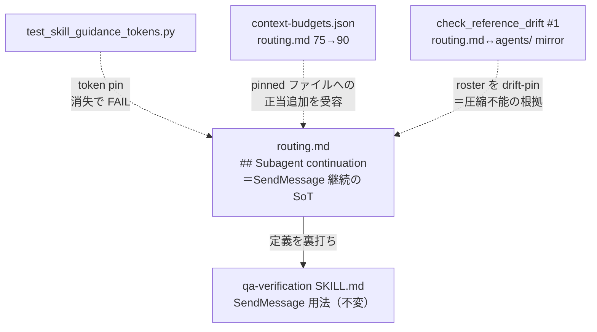

# 設計ノート — iter59 サブエージェント継続（SendMessage）の SoT 定義
<!-- 正本: brainstorming skill -->

## 入力

- ブレインストーミング記録: `docs/specs/2026-07-06-iter59-subagent-continuation-sot-brainstorm-record.md`
- 一次情報＝iter58 review 盲検2次 note1（`docs/qa-reports/iter58-review.md`）: `SendMessage` は
  iter58 で追加した qa.md/qa-verification にのみ出現し、`subagent-dev`/`routing.md` に「サブエージェント
  継続機構」としての**定義がない**＝dangling 用語。委譲経路がハーネス保証の契約か guidance 期待値かも
  本文から判別不能。修正案＝routing.md か subagent-dev に1行定義し qa-verification から参照。

## 問題整理

- 背景: iter58 で qa→qa-browser 委譲プロンプトに「途中停止は SendMessage で同一エージェント継続」を入れたが、
  `SendMessage` という機構語彙の**定義が正本ファイルに存在しない**。3年後に「SendMessage とは何か・実際に呼べるのか」を
  skill だけから再構築しにくい（review 2次 note1）。
- 判断が必要な論点: (1) 定義の置き場所（routing.md vs subagent-dev）、(2) 予算制約への対処。
  → いずれもユーザー決定済（2026-07-06）: **routing.md ＋ 最小 budget 引き上げ**。
- 制約条件: routing.md は budget=75・現在68・headroom 7。かつ **agent 列挙は `check_reference_drift #1` が
  `.claude/agents/*.md` と双方向 mirror で drift-pin**（削れない）。principle 以外に圧縮余地なし＝
  継続定義（~28トークン）に圧縮パスが存在しない。

## 推奨アプローチ

- `routing.md` に「Subagent continuation」節を追加し、`SendMessage` 継続を**単一正本**として定義。
  principle を1文化して bump を最小化し、`context-budgets.json` の routing.md budget を追加分だけ引き上げる。
- 継続定義を token pin（iter58 の決定論トリップワイヤ哲学を継承）。
- 代替案（subagent-dev 配置・最小スコープ注記のみ・budget ratchet policy 先行）は record のとおり却下。

## コンポーネント分解

- **`.claude/rules/routing.md`（改修）**: 末尾に節追加（英語・routing.md の言語に合わせる）:
  > ## Subagent continuation
  > Resume a stalled subagent via SendMessage (same agent, context preserved), not a fresh re-dispatch.
  > Guidance, not harness-enforced; bounded by each agent's `maxTurns` and the 3-failure rule.
  - principle を「Subagents only when they make work clearer/safer/smaller; else keep work in session context.」へ1文化（~6トークン圧縮）。
  - agent 列挙・browser-assist 参照・brainstorm 注記は不変（drift-pin/load-bearing）。
- **`scripts/context-budgets.json`（改修）**: `.claude/rules/routing.md` の budget を **75 → 90**（最小・追加分のみ）。
- **`tests/test_skill_guidance_tokens.py`（改修）**: routing.md を読み込み、継続定義の load-bearing トークン
  （`SendMessage`＋`harness-enforced` 相当の核）を pin。silent 消失で FAIL。
- **`qa-verification`（不変）**: 既存の SendMessage 用法が routing.md の定義で裏打ちされ dangling 解消。
  headroom 6 を割らないため編集しない。

## 予算引き上げの正当化（設計判断・最重要）

- iter58 は budget-raise を**却下**した（tighten-only ラチェットの anti-bloat 趣旨・qa-verification には
  圧縮可能な冗長があった）。**iter59 は状況が質的に異なる**: routing.md は内容が100% load-bearing
  （roster=drift-pin で削除すると `check_reference_drift #1` が FAIL・rule/参照は必須）＝**圧縮パスが存在しない**。
- よって「圧縮回避のための bump」ではなく「**圧縮不能な pinned ファイルへの正当な rule 追加の受容**」。
  bump は追加サイズ分に限定（75→90）。この区別を LEARNINGS に記録し、ラチェットの趣旨（不要な bloat 阻止）を守る。

### アーキテクチャ図

## インターフェース定義

- routing.md 継続定義 = 自然言語の運用ルール（機械契約ではない・guidance）。ハーネス強制しない。
- token pin = テストが routing.md 本文の必須トークンの存在を assert。

## データフロー / 構造

- qa（ui_surface:true）が qa-browser へ委譲 → 途中停止 → **routing.md 定義に従い SendMessage で同一
  qa-browser を継続**（コンテキスト保持）→ それも不能なら 3-failure ルールで blocker 記録。routing.md が
  「継続とは何か」の正本、qa-verification が qa 文脈での適用。

## 依存関係

- `check_reference_drift #1`（routing.md↔agents/ mirror）: 不変。agent 列挙は触らない。
- `context_budget` check: routing.md budget を 90 に更新後 PASS を維持。
- iter58 の `TestQaBrowserDelegation`（qa-verification の SendMessage pin）: 不変（qa-verification 編集しないため緑のまま）。

## エラー処理

- token pin テストは RED-first で「トークン削除→FAIL」を確認してから GREEN 化。
- budget 更新後に `context_budget.py` exit 0・`check_framework_contract`/`check_reference_drift` PASS を確認。

## テスト戦略

- `test_skill_guidance_tokens.py` に routing.md 継続定義の pin を追加（RED-first: 現行 routing.md には
  継続定義が無い＝追加前は pin が FAIL する）。
- B1 drill: docs/rule/skill 変更＝mutant 対象コードなしで SKIP＋RED-first 代替実証（token pin の RED 確認）。
- `check_reference_drift #1` が引き続き PASS（agent roster を触らないこと）を回帰確認。

## 移行・SemVer

- v1.19.0 → **v1.20.0（MINOR 想定）**: routing.md への rule 追加（後方互換・公開/運用契約は不変）。plan で最終確定。
- 規模 = **M**（`routing.md` ＋ `context-budgets.json` ＋ `test_skill_guidance_tokens.py` の3ファイル・framework・moat 非該当）。
  M framework は review+qa+security 必須・deploy 自動 exempt。
