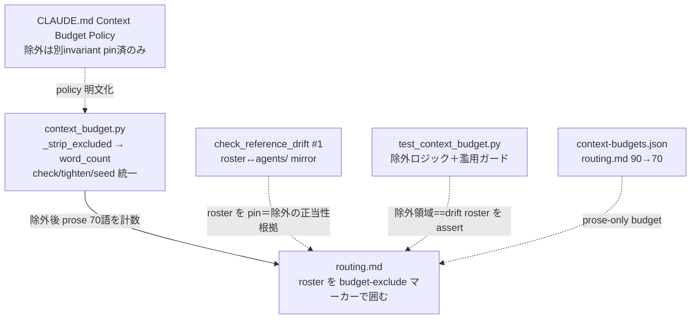

# 設計ノート — iter60 budget ratchet policy 見直し（drift 支配構造の計数除外）
<!-- 正本: brainstorming skill -->

## 入力

- ブレスト記録: `docs/specs/2026-07-06-iter60-budget-exclusion-brainstorm-record.md`
- 一次情報＝iter59 の headroom-0 問題と LEARNINGS（line18/122 統合・presence-pin）: tighten-only ラチェット下で
  最も編集頻度の高い guidance ファイルが budget floor に張り付く。実測（2026-07-06）: floor ファイル＝
  `routing.md`(headroom 0)・`state-machine.md`(0)・`bug-diagnosis`(2)、tight＝qa-verification(6)/client-workflow(7)、
  残り15は 13-37 と余裕。

## 問題整理

- **根本原因**: word-count budget（`len(text.split())`）は**全単語を等価**に数えるが、floor ファイルの語数の一部は
  「**別 invariant が支配する圧縮不能な構造**」。実測: `routing.md` 90語のうち agent roster ＝ **20語**
  （`check_reference_drift #1` が `.claude/agents/*.md` と双方向 mirror で pin＝削除で FAIL＝圧縮不能）、
  bloat しうる自由 prose は **70語**。budget が「bloat しようのない構造語」に食われ floor に張り付く＝
  **budget が本来 anti-bloat したい prose を測れていない**。
- **判断が必要な論点**（ユーザー決定済 2026-07-06）: (1) 方向＝**方向1「計数の意味を正す」**（構造を計数から除外）。
  (2) 除外機構＝**in-file マーカー**。(3) 濫用ガード＝**「除外領域は別 invariant で pin 済であること」をテスト必須**。
- **制約条件**: tighten-only ラチェット（自動引き上げ禁止）・drift・budget の後方互換を保つ。除外は opt-in
  （マーカー無しファイルは従来どおり全語計数）。headroom 再導入（方向3）はしない＝anti-bloat 趣旨を保持。

## 推奨アプローチ

budget の計数を「**別 invariant が支配する drift-pin 済構造を除外し、bloat しうる自由 prose のみを測る**」に正す。
除外は in-file マーカーで明示し、**除外の濫用（bloat 隠し）を「除外領域は別テストで pin 済でなければならない」policy＋
テストで封じる**。除外対象を持たない floor ファイルは floor-0 を正しい signal として受容し co-bump を文書化。

## コンポーネント分解

1. **`scripts/context_budget.py`（改修・単一 owner）**: 語数計数の前に **budget-exclude マーカー領域を strip** する。
   - マーカー: `<!-- aegis:budget-exclude-start -->` … `<!-- aegis:budget-exclude-end -->`（HTML コメント＝guidance ロード時も
     drift 抽出時も無害）。
   - `_strip_excluded(text)` を追加し、`check()`/`tighten()`/`seed()` の計数を `word_count(_strip_excluded(text))` に統一
     （3経路が同一 strip を通る＝乖離不能）。マーカー行自身も strip される。unmatched/nested マーカーは
     fail-graceful（strip せず全語計数＝安全側＝bloat を見逃さない）。
2. **`.claude/rules/routing.md`（改修）**: roster ブロック（`Subagents: …` から `Each agent's own file defines its domain.` まで）を
   マーカーで囲む。roster 内容・drift 対象は不変（マーカーは HTML コメントで backtick 抽出に非干渉）。
3. **`scripts/context-budgets.json`（改修）**: `routing.md` budget を **90 → 70**（prose 実測値・除外後の tighten）。
4. **`tests/test_context_budget.py`（改修）**: (a) 除外ロジックの単体テスト（マーカー領域が計数から除外される・
   unmatched は fail-graceful で全語計数）。(b) **濫用ガード**: `routing.md` の除外領域が **`check_reference_drift #1` が
   支配する roster と一致**することを assert（＝任意 prose を包んで budget を回避できない）。
5. **`CLAUDE.md`（改修・「## Context Budget Policy」節）**: policy を明文化＝「budget は bloat しうる自由 prose を測る／
   drift 等**別 invariant が pin 済の構造は除外可（テストで裏打ち必須）**」の**terse 1行**＋詳細は `context_budget.py` へ
   ポインタ。**⚠ 実装時訂正**: CLAUDE.md は context_budget レジストリの対象外だが、`check_framework_contract.py` の
   `MAX_CLAUDE_WORDS=650` で**別途 kernel budget が強制される**（当初「対象外＝無制約」は誤り・baseline 618/650・headroom 32）。
   よって policy は verbose 2項でなく terse 1行（~23語）に収める。floor co-bump（iter59 規則）は LEARNINGS 既載ゆえ CLAUDE.md では再掲せず。

## 濫用ガード（最重要・非自明）

- 除外は「マーカーで包めば budget を回避」の抜け穴になりうる。よって**除外の正当性を機械で裏打ち**する:
  「**除外してよいのは、成長を別 invariant が既に制御している内容だけ**」を policy とし、routing.md では
  「除外領域 == `check_reference_drift #1` が双方向 mirror で pin する roster」をテストで固定。
- 一般化（複数ファイルが除外を使う時）は YAGNI で先送り。現状 routing.md が唯一の除外利用＝routing.md 特化テストで十分。
  policy doc は一般形（「別 invariant で pin 済」）で書き、enforcement は現利用に限定。

## 残余 floor の扱い（方向1 で減らない分）

- `state-machine.md`(0)・`bug-diagnosis`(2) は除外対象の drift-pin 構造を持たない**密な必須 prose**（自由に bloat しうる
  prose が既に密）→ **floor-0 は正しい anti-bloat signal**。稀な編集時の co-bump（iter59 規則）を CLAUDE.md policy に
  明記するのみ（機構追加なし・YAGNI）。

### アーキテクチャ図

## インターフェース定義

- budget-exclude マーカー = `<!-- aegis:budget-exclude-start -->` / `<!-- aegis:budget-exclude-end -->`（行単位・HTML コメント）。
- `_strip_excluded(text) -> str`: マーカー対を含む領域を除去（unmatched は原文返し＝安全側）。
- 計数 = `word_count(_strip_excluded(text))`（check/tighten/seed 共通）。

## データフロー / 構造

- `context_budget.check()` が各 target を読む → `_strip_excluded` で drift-pin 構造を除去 → `word_count` で prose 語数 →
  budget と比較。routing.md は 70語 ≤ 70 budget で PASS。roster に agent を1体追加しても除外領域内＝**budget 不変**
  （drift が別途 roster↔agents/ を検証）。prose を追加すると budget 対象＝ratchet が捕捉（正しい anti-bloat）。

## 依存関係

- `check_reference_drift #1`（roster↔agents/ mirror）: 不変（マーカーは backtick 抽出に非干渉＝HTML コメント）。
  かつ濫用ガードの正当性根拠として参照。
- `context_budget` の tighten-only ラチェット: 不変（自動引き上げ禁止は維持・除外は計数側の変更）。
- iter59 の routing.md 継続節・token pin: 不変（prose 側＝除外しない＝budget 対象のまま）。

## エラー処理

- unmatched/nested マーカー → strip せず全語計数（fail-graceful・安全側＝bloat を隠さない）。
- 濫用ガードテストが「除外領域 ≠ drift roster」を検出したら FAIL（bloat 隠し検知）。
- budget 更新後 `context_budget.py` exit 0・`check_framework_contract`/`check_reference_drift` PASS を確認。

## テスト戦略

- **RED-first**: 除外ロジックのテスト（マーカー領域が計数から除外＝除外前の実装では全語計数で FAIL）＋
  濫用ガード（除外領域==roster）を RED→GREEN。
- **B1 drill**: context_budget.py は振る舞いコード＝**本物の mutation drill 可**（`_strip_excluded` の境界・fail-graceful 分岐に
  mutant を置く）。docs/rule のみの hunk は skip 判断だが、コア改修は drill する（iter54/59 の混在 diff 判断）。
- `check_reference_drift #1` が引き続き roster を pin（マーカー追加で PASS 維持）を回帰確認。
- full suite green・context_budget exit 0（routing.md 70/70）。

## 移行・SemVer

- v1.20.0 → **v1.21.0（MINOR 想定）**: 除外機構は**追加・opt-in**（マーカー無しファイルは従来どおり全語計数＝後方互換）。
  公開/運用契約は不変。plan で最終確定。
- 規模 = **M**（`context_budget.py`＋`routing.md`＋`context-budgets.json`＋`tests/test_context_budget.py`＋`CLAUDE.md` の5ファイル・
  framework・moat 非該当）。M framework は review+qa+security 必須・deploy 自動 exempt。
