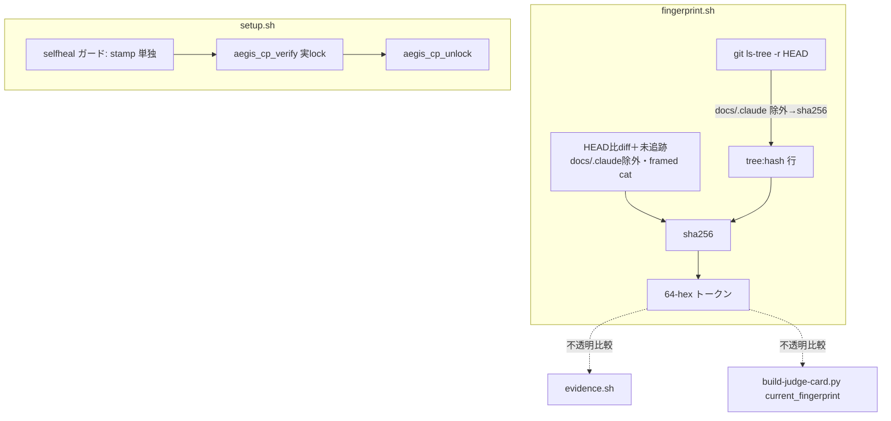

# ブレインストーミング記録 — iter64: fingerprint tree-hash 化＋OR marker 厳格化

## 日付

- 2026-07-08

## テーマ

- fingerprint を `head:<sha>` 束縛から「非 docs/.claude のコミット済 tree-hash」化（R6 根1・罠 r,b,c,d の根切り）。
- 併せて iter63 の OR marker LOW-1（`selfheal_unlock_target` の身元判定が `.aegis-install-version` **OR** `hooks/lib/cp-lock.sh`）を authoritative stamp 単独要求へ厳格化。

## コンテキスト

- 現在の状況: iter64・Dev/brainstorm・framework・全 dev ゲート pending。
- きっかけ:
  1. **R6 根1**（正本 `docs/full-review-2026-07-06-six-dimensions-evolution.md` §2 R6・§4 Phase 1「1-1」）。fingerprint.sh:87 が `head:<HEAD-sha>` をハッシュ入力に混入するため、**docs-only コミットで HEAD が進むと fp が動き**、無変更のコードに対する record が unverified 化する（罠 r）。これが「コミット→docs 修正→再 record」という順序制約 b/c/d を連鎖誘発し、「非エンジニアが回せる」北極星に逆行して正しい操作列の暗記を強制している。
  2. **iter63 security 盲検2次の approve_with_notes（LOW-1）**。`selfheal_unlock_target` の身元判定が OR で、`hooks/lib/cp-lock.sh`（単なる framework ファイル）の存在だけでも self-heal 経路に入り得る。authoritative なのは install stamp `.claude/.aegis-install-version` のみ。

## 検討したアプローチ

### アプローチ A（採用）: 非 docs/.claude の**コミット済 tree-hash** で `head:` 行を置換

- 概要: ハッシュ入力の先頭 `head:<sha>` 行を、`git ls-tree -r HEAD` の出力から `docs/`・`.claude/` パス行を除外→sha256 した `tree:<hash>` 行に置換。作業ツリー差分（HEAD 比変更＋未追跡、docs/.claude 除外）のハッシュは現状維持。
- 利点:
  - docs-only コミットは非 docs tree が不変＝fp 不変（罠 r 根絶）。
  - コード変更コミットは blob sha が動く＝tree-hash が動く＝silent-green 防止を**完全保存**（実証済み）。
  - トークン契約（stdout=64-hex|oversize|nogit|error）不変。consumer（evidence.sh / build-judge-card.py `current_fingerprint`）は 64-hex を不透明比較のみで `head:`/`tree:` 内部表現に非依存。
  - `head:<sha>` が拾っていた「無関係な履歴差（同一非docs tree で docs だけ違う commit）」を fp が区別しなくなる＝より正しい（コード状態が同一なら同一 fp）。
- 欠点: fp 定義が変わるため既存 record は一度だけ unverified 化（要再 record）。ただし marker_verified 導入時と同型の **fail-closed 移行**（silent-green にならない）。

### アプローチ B（不採用）: `head:<sha>` を残しつつ docs-only 判定で無効化

- 概要: HEAD 比 diff が docs/.claude のみなら fp を進めない特別分岐。
- 不採用理由: 分岐が増え、コミット履歴（HEAD 進行の意味論）に依存する複雑な条件になる。tree-hash 化は「コード状態そのもの」を直接ハッシュするので分岐不要・意味も明快。YAGNI に反する複雑化。

### アプローチ C（不採用）: fp を作業ツリー差分のみ（committed 成分を捨てる）

- 概要: `head:` 行を単に削除し、HEAD 比差分＋未追跡だけをハッシュ。
- 不採用理由: **silent-green が復活する**。「app.py をコミット→ツリーがクリーン→さらにコミット」で、記録時と検証時の作業ツリー差分が両方空になり fp が一致、未テストの新コミットが green 認証される（既存テスト `test_new_commit_changes_fp_even_when_tree_clean` が RED になる）。committed 成分は必須。

### OR marker（採用）: authoritative stamp 単独要求

- 概要: `selfheal_unlock_target` の早期 return ガードを `[ ! -f .aegis-install-version ] && [ ! -f cp-lock.sh ]`（=OR 許可）から `[ ! -f .aegis-install-version ]`（=stamp 単独）へ。
- 採用理由（実証済み安全性）: `.aegis-install-version` stamp は K-11（`66e59e8`・2026-06-13）で導入、cp-lock（moat layer-2）は `1e46e4d`・**2026-06-21（8日後）**。よって OS-lock され得る install は必ず stamp を持つ＝厳格化で正規 self-heal を一切失わない。stamp は locked CP 集合（`hooks`/`scripts`/`templates`/`CLAUDE.md`/`.claude/{rules,skills,commands,agents}`）に含まれないため lock 下でも読める。第2の防御（`aegis_cp_verify` が実 lock を要求）は不変。

## 決定

- **採用**: アプローチ A（tree-hash 化）＋ OR marker stamp 単独要求。
- **不採用**: B（複雑化・YAGNI）、C（silent-green 復活）。

## 構造マップ

## スコープ境界

- やること:
  - `hooks/lib/fingerprint.sh`: `head:` 成分を非 docs/.claude の committed tree-hash に置換。ヘッダ契約コメント更新。
  - `tests/test_fingerprint_lib.py`: docs-only コミット不感テスト（RED-first）追加、docstring 更新。既存 14 テストは無改変で維持。
  - `bin/setup.sh`: `selfheal_unlock_target` の身元ガードを stamp 単独へ。コメント（628 付近）更新。
  - `tests/test_setup_locked_target_upgrade.py`: 「cp-lock.sh はあるが stamp 無し→self-heal 発火しない」テスト（RED-first）追加。既存 5 テスト維持。
- やらないこと:
  - consumer（evidence.sh / build-judge-card.py）の改変（契約不変・不要）。
  - R6 の他項目（1-2 judge skip-and-continue 等）— 別 iter。
  - fp 移行の自動 re-record 機構（fail-closed unverified で十分・marker_verified 前例）。
  - version bump 以外の配布物変更。

## 未解決事項

- なし（tree-hash 挙動・OR marker 安全性ともに本セッションで実 git 実証済み）。

## 次のステップ

- [x] 設計ノートを作成する → `docs/specs/2026-07-08-iter64-fingerprint-tree-hash-design.md`
- テンプレート名: `SPEC.template.md`
