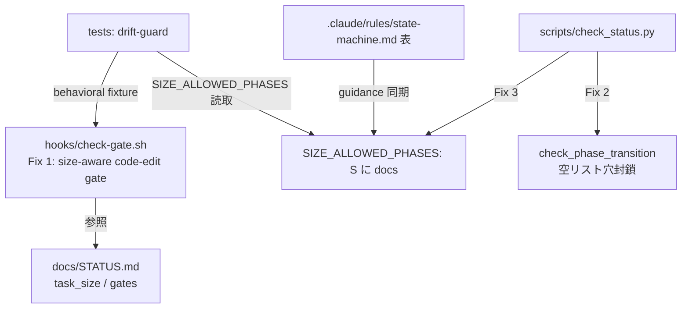

# ブレインストーミング記録
<!-- 正本: brainstorming skill -->

## 日付

- 2026-07-10（iteration 65）

## テーマ

- **S サイズ修復** — full-review §R2🔴 / §4 Phase 1 項目 1-4。
  S サイズが feature/refactor でコード編集に構造的に使えない欠陥を、三者不整合
  （rule 文書「skipped phases exempt their gates」○ ／ `check_status.py` 実装○ ／
  `hooks/check-gate.sh` 未実装✗）を bash 側へ揃えることで解消する。

## コンテキスト

- 現在の状況: iter64（v1.25.0）まで完走・push 済（origin/main=3a69f2d）。Phase 1 の残り。
- きっかけ: 正本 `docs/full-review-2026-07-06-six-dimensions-evolution.md` §R2/§4 表 1-4。
- 実地確認済みの根:
  - `hooks/check-gate.sh` は `task_size` を **一切参照せず**（grep 0 件）、コード編集を
    無条件で **plan gate 承認**要求（:247-252）。
  - `SIZE_ALLOWED_PHASES["S"]` = `{brainstorm, implement, review, ship}` に **plan が無い**。
  - `pre_na_gate` は brainstorm/plan の n/a を **bugfix/hotfix 限定** →
    feature/refactor/framework は S でも plan を n/a にできない。
  - 帰結: S の feature/refactor は 1 ファイル編集すら不能 → 全反復が M 儀式へ逃避（過剰 OH 主因）。
  - `check_status.py` 側は既に size-filter 済（:694-698 で plan を S から除外）＝
    **bash hook だけが未実装**。
  - 併発（罠 q）: `check_phase_transition` は `allowed_after_old` が空リスト（old が
    size の terminal）だと adjacency 検査をスキップ（:1341）→ ship→docs が rc0 通過しつつ
    静的検査（:652 docs∉S）で FAIL する「割れ」。

## 検討したアプローチ

### 判断点1: check-gate.sh が size→gate をどう判定するか

#### アプローチ A（採用）: bash 側で size を読む pure-bash 最小ルール＋drift-guard

- 概要: `check-gate.sh` が既存 pure-bash ヘルパ（`frontmatter_value`/`gate_value`）で
  `task_size` を読み、コード編集を守るゲートを「size フローで implement 直前の承認ゲート」に
  差し替え（S→brainstorm・それ以外/未設定→plan）。size↔gate 対応の陳腐化は python 側
  `SIZE_ALLOWED_PHASES` を読む drift-guard テストで検知。
- 利点: Foundation で python3 依存の fail-open を排除した設計（pure-bash 判定）を踏襲。
  ゲート判定に外部依存を持ち込まない。drift-guard で bash ハードコードの陳腐化を機械検知
  （iter53 REGEX↔WARN parity パターン）。
- 欠点: 「S は plan を skip する唯一の size」という事実が bash に第2コピーとして載る
  → drift-guard で緩和。

#### アプローチ B（不採用）: check-gate.sh が python に委譲

- 概要: `python3 check_status.py --check-code-edit-allowed` を呼び allow/deny を relay。
- 利点: `SIZE_ALLOWED_PHASES` を python 単一ソースに保てる。
- 不採用理由: **deny 判定を python3 に依存させると fail-open が再発**（python3 不在で gate が
  素通り）。Foundation が emit.sh を pure-bash 化して潰した病理そのもの。moat 退行。

### 判断点2: 罠 q（S terminal の割れ）の潰し方

#### アプローチ 3a（採用・正本推奨・ユーザー承認）: `SIZE_ALLOWED_PHASES["S"]` に docs 追加

- 概要: `{brainstorm, implement, review, ship}` → `+docs`。terminal を M/L と統一。
- 利点: 静的検査（:652）の docs∉S 誤 FAIL が消え、ship→docs が正当化。**docs は gate 強制
  されない**（`dev_ready_for_client` は phase==docs を要求しない：:983-989）ので S に新儀式は
  増えず、ship 完了も docs も両方可＝純加算的。特殊分岐を「増やさず減らす」方向。
- 欠点: S が概念上「4 フェーズ」でなくなる（軽微）。

#### アプローチ 3b（不採用）: S=ship terminal 維持・ship→docs を clean-deny

- 概要: S を 4 フェーズのまま保ち、ship→docs を transition/static 両層で明示 deny。
- 不採用理由: 特殊分岐が減らず増える。ship→docs を習慣的に行う operator に壁が残る。
  静的層でも docs∉S を塞ぐ必要があり、3a より複雑。

### 判断点3: 空リスト穴（Fix 2）を本反復に含めるか

- 決定: **含める**（ユーザー承認「3点フル」）。3a 採用で穴は dormant 化するが、terminal からの
  前進を明示 deny する不変条件を explicit にし回帰テストで固定（defense in depth・将来 size 追加で
  terminal が docs より手前になった場合の phase-skip を防ぐ）。

## 決定

- 採用アプローチ: **A（pure-bash＋drift-guard）＋ 3a（docs を S へ）＋ Fix 2（空リスト穴封鎖）＋
  guidance 同期（state-machine.md 表）**。
- 採用理由: 全修正が既存機構内の配線変更でリスク低・operator 体験が一変（正本「最大 ROI」）。
  pure-bash 判定で fail-open を避け、drift-guard で bash 側複製を機械保全、3a で特殊分岐を縮減、
  guidance 同期で R9 型 enforcement↔doc drift を残さない。
- 不採用理由: B は fail-open 退行、3b は特殊分岐増。

## 構造マップ

## スコープ境界

- やること:
  1. `check-gate.sh` を size-aware に（S→brainstorm・他→plan、approved/na 許容、pure-bash）。
  2. `check_status.py` の `check_phase_transition` 空リスト穴封鎖。
  3. `SIZE_ALLOWED_PHASES["S"]` に `docs` 追加。
  4. behavioral テスト（size×gate-state）＋drift-guard テスト＋transition RED。
  5. 既存テストの「docs∉S」assert 反転。
  6. `.claude/rules/state-machine.md` 表の S 行を `impl->review->ship->docs` に同期。
- やらないこと:
  - check-gate.sh の python 委譲化（B）。
  - `task_size != "S"` 特殊ガードのリファクタ（qa/security 免除・別テーマ）。
  - Phase 1 の他項目（1-1〜1-3, 1-5, 1-6）— 本反復は 1-4 のみ。
  - S の docs 到達を gate 強制すること（純加算・任意のまま）。

## 未解決事項

- なし（実配線・完了境界・免除ガードすべて実地確認済み）。

## 次のステップ

- [x] 設計ノートを作成する → `docs/specs/2026-07-10-iter65-s-size-repair-design.md`
- テンプレート名: `SPEC.template.md`
<!-- exit-check: アプローチ決定・スコープ明確 → design note へ -->
