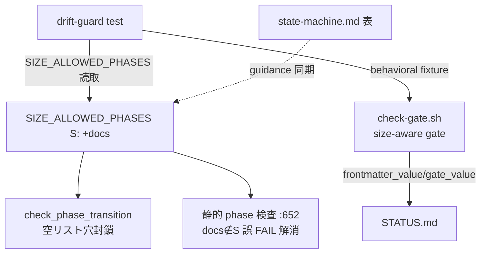

# 設計ノート
<!-- 正本: brainstorming skill -->

## 入力

- ブレインストーミング記録: `docs/specs/2026-07-10-iter65-s-size-repair-brainstorm-record.md`
- 要件: full-review 正本 `docs/full-review-2026-07-06-six-dimensions-evolution.md` §R2 / §4 表 1-4

## 問題整理

- 背景: `hooks/check-gate.sh` が `task_size` を参照せず、コード編集を無条件で **plan gate**
  承認要求（:247-252）。S の phase 集合に plan が無く、feature/refactor/framework は plan を
  n/a にもできない（`pre_na_gate` は bugfix/hotfix 限定）ため、**S でコード編集が構造的に不能**。
  `check_status.py` は既に size-filter 済（:694-698）で、**bash hook だけが未実装**の三者不整合。
- 判断が必要な論点: (1) bash が size→gate をどう判定するか（→ pure-bash＋drift-guard 採用）、
  (2) 罠 q の潰し方（→ 3a: docs を S に追加 採用）、(3) 空リスト穴を本反復に含めるか（→ 含める）。
  いずれも brainstorm 記録で決定済み。
- 制約条件:
  - ゲート deny 判定は **pure-bash**（python3 依存は fail-open 退行＝Foundation 設計に反する）。
  - `task_size` の変更は `update-task.sh` 経由のみ（raw edit は tamper block）。
  - control-plane（gate 強制ロジック）変更のため review+qa+security 必須・M（deploy skip）。

## 推奨アプローチ

- 採用方針: **A（pure-bash size 判定＋drift-guard）＋ 3a（docs を S へ）＋ Fix 2（空リスト穴封鎖）
  ＋ state-machine.md 表の guidance 同期**。
- 採用理由: 全修正が既存機構内の配線変更でリスク低、operator 体験が一変（正本「最大 ROI」）。
  fail-open を避け、bash 側複製を drift-guard で機械保全、特殊分岐を 3a で縮減、doc drift を残さない。
- 検討した代替案と不採用理由: B（python 委譲）= fail-open 退行 ／ 3b（S=ship terminal 維持）=
  特殊分岐増。

## コンポーネント分解

- 分割方針: 3 つの独立した配線変更（bash gate / transition 穴 / size-map）＋テスト＋doc 同期。
- 各ユニットの責務:
  - ユニット A（`hooks/check-gate.sh`）: `task_size` を pure-bash で読み、コード編集を守るゲートを
    `S→brainstorm` / `それ以外・未設定→plan` に差し替え。`approved` OR `n/a` を許容。
  - ユニット B（`scripts/check_status.py` `check_phase_transition`）: 前進遷移かつ
    `allowed_after_old` が空（old が terminal）なら明示 deny。terminal 専用メッセージ。
  - ユニット C（`scripts/check_status.py` `SIZE_ALLOWED_PHASES["S"]`）: `docs` を追加。
  - ユニット D（tests）: behavioral（size×gate-state で allow/deny）＋drift-guard
    （`SIZE_ALLOWED_PHASES` から「plan を skip する size は S のみ」を assert）＋transition RED
    ＋既存 assert 反転。
  - ユニット E（`.claude/rules/state-machine.md` 表）: S 行を `impl->review->ship->docs` へ。

### アーキテクチャ図

## インターフェース定義

- ユニット間の契約:
  - A → STATUS: 入力=`task_size`(S|M|L|未設定), 該当ゲート値。出力=allow/deny(JSON)。
    エラー=lib source 失敗時 fail-closed deny（既存 safety fallback）。
  - drift-guard → check_status: `SIZE_ALLOWED_PHASES` を import/読取し bash 側前提を検証。
- 公開 API（挙動契約）:
  - `check-gate.sh`: S かつ brainstorm=approved/na → allow ／ S かつ brainstorm=pending → deny
    ／ M・L・未設定は plan で従来どおり ／ bugfix/hotfix（n/a）は自然通過。
  - `check_phase_transition`: terminal からの前進遷移 → rc1（従来は空リストで rc0 の穴）。
  - `SIZE_ALLOWED_PHASES["S"]` に docs 含む → 静的検査・transition で docs 正当。

## データフロー / 構造

- 入力: PreToolUse の Edit/Write（`check-gate.sh`）、`--check-phase-transition old new`
  （`check_status.py`）、STATUS.md frontmatter。
- 処理: A=size 読取→gate 名決定→gate 値判定。B=前進かつ空リストなら deny。C=集合に docs 追加。
- 出力: allow/deny JSON（hook）、rc 0/1（transition/static）。

## 依存関係

- 依存方向: `check-gate.sh` → `lib/{safety,extract-input,emit,frontmatter}.sh`（既存・pure-bash）。
  drift-guard test → `check_status.py`。循環なし。
- 外部依存: なし（python3 は **判定経路に持ち込まない**）。

## エラーハンドリング

- 想定失敗:
  - lib source 失敗 → 既存 `AEGIS_SAFETY_FALLBACK` で fail-closed deny（変更なし）。
  - `task_size` 未設定/不正 → S 以外扱い＝plan 要求（後方互換・従来挙動）。
  - 空リスト穴 → 前進遷移を明示 deny（terminal 専用メッセージ）。
- 対応: 未設定は保守的に plan 要求（gate を緩めない）。
- エラー伝播の方針: deny は pure-bash のみ（python3 経路に依存しない）。

## テスト戦略

- 単体:
  - `check_phase_transition`: terminal からの前進 → deny（RED-first）。
  - `SIZE_ALLOWED_PHASES["S"]` に docs 含む assert、静的検査で S+docs が pass。
- 結合（behavioral）:
  - `check-gate.sh` を STATUS fixture で起動: **S-feature brainstorm=approved → allow**（現行 RED）、
    **S-feature brainstorm=pending → deny**、M/L は plan 従来どおり、bugfix S（brainstorm=n/a）→ allow。
- エッジケース:
  - `task_size` 未設定 → plan 要求（後方互換）。
  - drift-guard: `SIZE_ALLOWED_PHASES` から「plan を skip する size は S のみ」を assert
    （将来 size 追加で bash ハードコード陳腐化を検知）。
  - 既存テストの「docs∉S」assert を反転。
- 手動確認: full suite green（無回帰）＋ 実フック起動で S-feature の Edit allow をドライラン。

## 次のステップ

- [ ] 実装計画を作成する → `docs/plans/2026-07-10-iter65-s-size-repair-implementation-plan.md`
- テンプレート名: `PLAN.template.md`
- 本設計ノートのパスを PLAN の「参照設計」に記載すること
<!-- exit-check: 全セクション記入・自己レビュー完了 → plan へ -->
