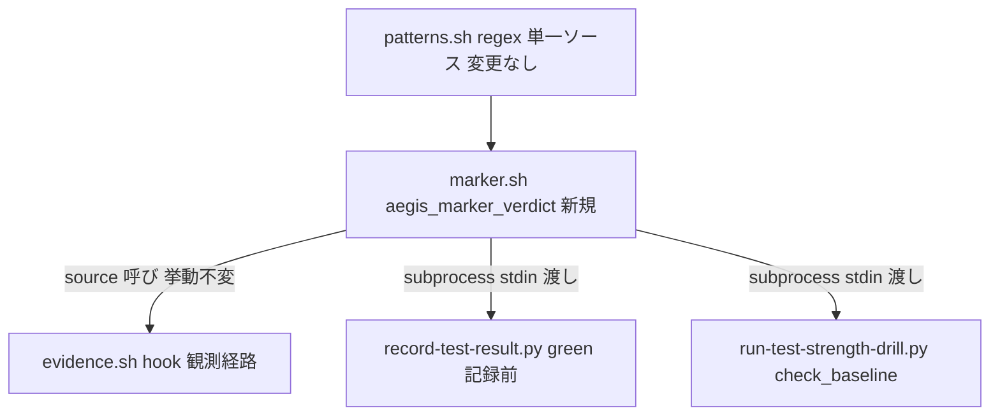

# 設計ノート
<!-- 正本: brainstorming skill -->

## 入力

- ブレインストーミング記録: docs/specs/2026-07-15-iter71-marker-positive-proof-brainstorm-record.md
- 要件: なし（framework 自己改善・動機正本は docs/security-followups.md SF-014／docs/LEARNINGS.md line148 conf9）

## 問題整理

- 背景: 反ガミング検証3系統のうち record-test-result.py と B1 drill が「悪い入力を列挙する」denylist 構造のままで、runner 該当かつ0テスト実行・exit 0 のコマンド（`unittest discover -p <nomatch>`／`npm test`→`"test":"true"`／非ランナー import プローブ）で green／DRILL PASS を偽造できる（実測済み・pre-existing）。一方 patterns.sh＋evidence.sh には「良い実行が起きた証拠を要求する」4段検証（positive proof）が既にあり、hook 観測経路だけが使っている。
- 判断が必要な論点: チェッカーの共有方式（決定: bash 単一実装）／marker 不成立 green の扱い（決定: rc2 拒否）／スコープ（決定: record+drill、audit_deps は iter72）。
- 制約条件: evidence.sh の既存挙動は不変（既存テストで pin）。patterns.sh の regex は grep-E ∩ python-re 共通部分集合の契約（tests/test_patterns_parity.py）。record の運用契約は「judge が読める green だけを記録する」方向の accept 集合縮小＝iter70 前例と同型の MINOR。

## 推奨アプローチ

- 採用方針: `hooks/lib/marker.sh`（新規）に4段検証コアを抽出し、evidence.sh（source）・record-test-result.py（subprocess）・run-test-strength-drill.py（subprocess）の3消費者が同一実装を使う。
- 採用理由: ロジック単一・言語間 drift ゼロ・`check_no_run_command` の同一エンジン前例に整合（iter69 conf8）。
- 検討した代替案と不採用理由: python port（4段ロジックの2重実装＝SF-014 と同型構造の再生産）／evidence.sh CLI モード（hook エントリポイントと lib の責務混在）。詳細は brainstorm-record。

## コンポーネント分解

- 分割方針: 判定コアを1箇所に置き、消費者は「呼んで fail-closed に従う」だけにする。
- 各ユニットの責務:
  - `hooks/lib/marker.sh`（新規）: `aegis_marker_verdict <exit_code> <command>`。テスト出力を **stdin** で受け、4段検証（NO_RUN flag 失格 → STRONG marker → WEAK pair 両半 → zero-run gate〔出力信号・pytest exit5・prologue〕）を実行し stdout に `true`/`false`。patterns.sh 不読・配列空など評価不能は **rc3**（fail-closed 用の区別された終了コード）。ロジックは evidence.sh の `_check_test_marker` から**移動のみ・変更なし**。
  - `hooks/lib/evidence.sh`: raw-hook-input JSON の unwrap（cmd/exit_code/output 抽出）だけ残し、判定は marker.sh を source して呼ぶ。挙動不変。
  - `scripts/record-test-result.py`: 実行後 `status=ok` のとき verdict を subprocess（`bash -c 'source hooks/lib/marker.sh; …'`・対象 root の patterns.sh/marker.sh を使用）で要求。`true` → green 記録＋エントリに `"marker": true` を追加（監査透明性・judge 非消費の additive フィールド）。`false`/rc3/subprocess 失敗 → **rc2・ログ非書込**・stderr に理由と対処（対象ランナー: pytest/jest/vitest/go/cargo/unittest、未収載ランナーは patterns.sh の marker 拡張を検討）。red（exit≠0）は marker 不要で従来通り記録。
  - `scripts/run-test-strength-drill.py`: `check_baseline` で exit-green の後に verdict を要求。`false`/rc3 → `DRILL BLOCKED (baseline no-test-proof)` として fail-closed（report にも記録）。mutant 実行側・sanctioned skip 経路は変更なし。

### アーキテクチャ図

## インターフェース定義

- ユニット間の契約:
  - 消費者 → marker.sh: 入力＝argv `<exit_code> <command>`＋stdin（テスト出力**全文**）。出力＝stdout `true`/`false`（rc0）、rc3＝評価不能。command は WEAK/zero-run の pytest 系分類（`AEGIS_TEST_IS_PYTEST_REGEX`）と NO_RUN 失格に使用。
  - record/drill → bash: `subprocess.run(["bash","-c",…], input=output_bytes)`。timeout 付き。rc0 以外・stdout 不正はすべて「不成立」扱い（fail-open なし）。
- 公開 API: なし（内部機構。運用契約面は record CLI の green accept 集合縮小のみ）

## データフロー / 構造

- 入力: テストコマンドの実行結果（exit code＋出力全文）
- 処理: 4段検証で「N≧1 件のテストが実際に実行され pass した」構造的証跡を要求
- 出力: record＝green エントリ（`marker: true`）または rc2 拒否／drill＝baseline 続行または BLOCKED

⚠️ 既知の罠（実装で pin）: record の `payload_sha` は出力**先頭 64KiB** を取るが、marker（サマリ行）は出力**末尾**にある。verdict は必ず**全文**に対して実行する（sha の cap は従来のまま）。

## 依存関係

- 依存方向: record/drill → marker.sh → patterns.sh（循環なし）。evidence.sh → marker.sh。
- 外部依存: bash＋grep（framework 既存前提・追加依存なし）

## エラーハンドリング

- 想定失敗: patterns.sh 不読／marker 配列空／bash・grep 実行失敗／subprocess timeout／stdout 不正値
- 対応: marker.sh は rc3 で「評価不能」を区別。record は rc2 拒否（runner 照合 None 経路と同じ fail-closed 文言方針）、drill は DrillError。
- エラー伝播の方針: 評価不能=拒否（fail-open なし）。緩和は一切入れない（LEARNINGS conf7: 緩和は充足不可能な要求の削除限定）。

## テスト戦略

- 単体（TDD RED 先行）:
  - record: `unittest discover -p 'nomatch*'`（exit0・`Ran 0 tests`）→ rc2＋ログ非書込〔現行 green＝RED 証明〕／`npm test`＋`"test":"true"` fixture → rc2／正規 pytest → green＋`marker:true`／red 実行 → 従来通り記録（非退行）／patterns.sh 欠損 root → rc2／**64KiB 超出力で末尾 marker → green**（先頭 cap 罠の pin）
  - drill: 非ランナー import プローブ test_command（baseline exit0）→ BLOCKED no-test-proof〔現行偽 PASS＝RED 証明〕／正規 baseline → PASS 非退行
  - marker.sh: rc3 系（patterns 不読）／true/false 系（STRONG・WEAK 両半・zero-run 打ち消し）
- 結合: evidence.sh 既存 hook テスト green のまま（抽出の挙動不変を pin）／tests/test_patterns_parity.py 不変
- エッジケース: WEAK pair の片半のみ → false／`echo` 偽造 marker＋zero-run 信号 → false／pytest exit5 → false
- 手動確認: 本 iter 自身の qa で B1 drill・E2E（record の拒否/受理を実走）

## 次のステップ

- [ ] 実装計画を作成する → `docs/plans/2026-07-15-iter71-marker-positive-proof-implementation-plan.md`
- テンプレート名: `PLAN.template.md`
- 本設計ノートのパスを PLAN の「参照設計」に記載すること
