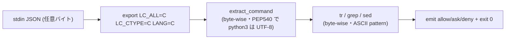

# 設計ノート
<!-- 正本: brainstorming skill -->

## 入力

- ブレインストーミング記録: `docs/specs/2026-07-18-iter73-locale-byte-sweep-brainstorm-record.md`
- 要件: なし（framework 内部 hardening・requirements gate は N/A 継続）
- 動機正本: iter72 F-CRIT-1（`docs/security-followups.md` SF-014 内・commit 90b4b61）／
  next_action（iter73 掃討方針・2026-07-18 ユーザー合意）

## 問題整理

- 背景: iter72 で marker.sh の locale 依存 grep を `LC_ALL=C`（関数 local）で byte-wise 化した。
  deny 側 moat フック（`check-destructive.sh`・`check-secrets.sh`）は agent 統制の Bash コマンド
  テキストを `tr`/`grep` で処理するが LC_ALL 設定ゼロ。同型の locale 依存が残存する。
- 判断が必要な論点:
  1. 実際に fail-open するか（機構と exploitability）→ **実証済み**（下記「実証結論」）。
  2. severity（next_action の HIGH 仮説の当否）→ **実証で hardening/Medium に格下げ**。
  3. スコープ（どのフックまで掃討するか）→ **実証で crash する 2 フックに限定**。
  4. 修正の配置（python3 抽出を C locale で壊さない）→ **抽出直後に export**。
- 制約条件:
  - control-plane（反ガミング moat）を触る＝review+qa+security 必須。
  - 「rushed control-plane 変更は新規バグ源」（SF 系の戒め）＝最小・漏れない・pin 付き。
  - フック契約: 常に JSON 判定を emit し exit 0（`docs/hook-failure-policy.md`）。
  - 脅威モデル（`security-followups.md` canonical 節）＝**LLM の事故的自己バイパス**。Bash 任意
    コマンド経路は「敷居を上げる層」（sandbox でない・SF-004 原理的限界）。

## 実証結論（2026-07-18/19・ローカル実測。CI/Linux GNU grep では grep 経路も加わる想定）

- **機構**: 不正 UTF-8 バイトを含む Bash コマンド → `extract_command` の grep fast-path が raw
  バイト保持の CMD を返す → `CMD_LOWER=$(...| tr '[:upper:]' '[:lower:]')`（または check-secrets
  の `CMD_LC`）の **`tr` が UTF-8 locale で `Illegal byte sequence` でクラッシュ** → `set -euo
  pipefail` で**フックが rc=1・出力なしで異常終了** → 破壊的 warning / シークレット deny が
  emit されず fail-open。BSD grep（macOS の `/usr/bin/grep`）自体は末尾バイトを取りこぼさない
  （MATCH 実測）ため、macOS では **crash が支配機構**。GNU grep（Linux）では iter72 同様の
  grep poison も併発しうる＝`LC_ALL=C` は両方を一括で封鎖する。
- **スコープ**: crash は `check-destructive.sh`・`check-secrets.sh` **のみ**で発生（実測 rc=1）。
  `post-bash.sh` は tr/grep=0＝非該当。以下は掃討の完全性のための**恒久記録（再提起防止・SF-007
  流儀）**:
  - `check-runtime-state.sh`（grep×30・moat・CMD 処理）**非該当**＝CMD を **python3 の json.loads
    で先に抽出**するため、不正バイト stdin は `sys.stdin.read()` の UTF-8 decode で UnicodeDecodeError
    →`2>/dev/null || true`→**空 CMD**（tr に不正バイトが届かない）。byte-in-CMD で rc=0・`{}` を実測。
  - `check-deploy-gate.sh`（moat・python3 依存）**非該当**＝CMD 抽出後 tr せず `grep -qEi` を通り、
    BSD grep はバイトでクラッシュ/取りこぼしせず（deploy 語に非該当なら allow）。rc=0・`{}` を実測。
  - 差＝両フックは **tr を CMD に直接掛ける**（destructive/secrets）か否か。extract 方式（grep-first で
    raw バイト保持 vs python3-first で decode 失敗→空）と `tr` の有無が crash 可否を決める。

### 到達性（reachability）— grill 指摘1 の実証結論（2026-07-19）

> **本件は「reachable fail-open」ではなく「defensive robustness hardening」**。severity を実証で
> 再較正した（next_action の HIGH → hardening・脅威モデル内の到達性はゼロ）。

- **crash は不正 UTF-8 バイト列でのみ発生**。valid UTF-8（CJK・emoji〔4byte〕・結合文字・RTL・
  zero-width・混在）は `tr` をクラッシュさせない（実測・全 OK）。
- **モデルが emit する `tool_input.command` は常に valid UTF-8**。モデル出力はトークン→Unicode
  コードポイントで、Unicode は構造上必ず valid UTF-8 にエンコードされる（U+10FFFF まで実測）。JSON
  payload も UTF-8。よって**不正バイトは通常のモデル→tool-call→hook 経路では生成されない**。
- コマンド置換（`rm -rf $(cat badbyte-file)`）でもフックが見るのは**コマンド文字列**（valid UTF-8）で
  あり、`$()` 展開はフック後にシェルが行う＝不正バイトはフックに届かない。
- **脅威モデル（LLM 自己バイパス）内で crash は到達不能**＝SF-009（forward-looking・現状到達不能）と
  同カテゴリ。fail-open 自体も `hook-failure-policy.md`「parse 失敗時 allow」の許容範囲。
- **crash の位置づけ（grill 指摘3）**: これは policy 表の「parse-fail→allow」でも「lib欠落→deny」でも
  ない**第3の未定義状態＝parse は成功（CMD 非空）したが下流の tr がクラッシュ**する経路。fix は
  「判定を最後まで走らせ正しい ask/deny を出す」ことでこの未定義状態自体を消す。

- **fix の妥当性（到達不能でも直す理由）**: (1) **堅牢性契約**＝制御フックは**任意 stdin で
  クラッシュしてはならない**（lib 欠落には fail-closed で応える一方、stdin バイトで rc1 異常終了＋
  自前 raw fail-safe fallback〔check-destructive.sh:38-54〕迂回は不整合）。非モデル呼出し（テスト・
  将来機能・直接起動）や将来の Claude Code 変更に対する forward-looking な堅牢化。(2) iter72
  marker.sh と同型を残さない一貫性。(3) stderr ノイズ（`tr: Illegal byte sequence`）除去。
- **やらない選択（SF 記録に留める）も妥当だった**が、fix が 1 行×2＝SF 起票・追跡より安価で、
  掃討を「文書化済み未修正の不整合」で終えるより閉じる方が筋が良いと判断（YAGNI 境界の判断）。

## 推奨アプローチ

> **実装で判明した配置修正（2026-07-19・Task 3 implementer が実証）**: 当初設計は「`CMD=$(extract_command)`
> の**直後**（抽出の python3 fidelity を守るため）」に export を置く想定だったが、この前提は**誤り**だった。
> `extract_command` の **grep/sed fast-path 自体が UTF-8 locale 下で不正バイトのコマンドを空にドロップ**
> する（実測: byte-carrying コマンドの抽出が UTF-8→LEN=0／C→LEN=22）。抽出後に export しても手遅れで、
> check-secrets では空 CMD→`[ -z "$CMD" ]` fallback が **deny を ask に格下げ**する（実測でテスト FAIL）。
> よって export は**抽出前（`INPUT=$(cat)` 直後）**に置き、grep fast-path も byte-wise 化する。C locale が
> 抽出の python3 経路を壊さないことは **PEP 540（CPython は C/POSIX locale で UTF-8 Mode 自動有効・
> `utf8_mode=1`・stdin=utf-8）**で担保され、valid 多バイトの抽出が C vs UTF-8 で byte 一致することを実測確認。
> 両フックとも抽出前配置に統一（check-destructive は fallback も ask ゆえ挙動不変だが、main path で正しく
> 判定する方が正当・一貫）。

- 採用方針: **各フックの `INPUT=$(cat)` の直後（`CMD=$(extract_command "$INPUT")` の前）に
  `export LC_ALL=C LC_CTYPE=C LANG=C` を 1 行追加**し、抽出の grep/sed fast-path・raw-input fallback
  ブロックを含む**フック全体**の tr/grep/sed を byte-wise 決定化する（アプローチ A・配置は抽出前へ修正）。
- 採用理由: 実証 footprint（2 フック・crash 支配）に対し最小で漏れがない。フックは**トップレベルの
  独立プロセス**なので、フック全体を C locale にしても呼び出し元へ漏れない（iter72 が marker.sh を関数
  local に留めたのは lib が消費者へ locale を漏らさないため＝top-level フックには非該当）。抽出の
  python3 は PEP 540 UTF-8 Mode で UTF-8 fidelity を保つ。iter72 の LC_ALL=C 方針と一貫。
- 検討した代替案と不採用理由:
  - B（tr/grep 個別 prefix・23+ 箇所）: 付け漏れリスク・差分肥大・control-plane 大量改変。
  - C（共有ヘルパー＋crash-safe trap）: blast radius 拡大・trap は control-plane 構造変更＝別テーマ
    の scope creep。crash-safe 契約の恒久化は将来候補として記録に留める。
  - **D（共有 lib `extract-input.sh` を改変して一括 byte-safe 化）不採用**（grill 指摘要検討1）: 単一
    ソースで全 caller 被覆できるが、`extract_command` は複数フックが共有する lib 関数で、ここに locale
    決定を埋めると**全 caller に locale ポリシーを強制**する（blast radius 大・iter72 が marker.sh を
    関数 local に留めたのと同じ「共有 lib は消費者の locale を勝手に変えない」原則）。代わりに**各
    top-level フックが抽出前に自プロセスの locale を C に固定**する（フックはプロセスなので漏れない・
    PEP 540 で python3 fidelity は保たれる）。当初「抽出層を触ると python3 を壊す」と書いたのは誤りで、
    真の不採用理由は共有 lib への locale 埋め込みの blast radius（PEP 540 実証で python3 破壊は否定）。

## コンポーネント分解

- 分割方針: フック 2 本＋テスト。moat コアの挙動（判定ロジック）は**不変**、locale 決定化のみ additive。
- 各ユニットの責務:
  - **`hooks/check-destructive.sh`**: `INPUT=$(cat)` の直後（`CMD=$(extract_command "$INPUT")` の**前**）に
    `export LC_ALL=C LC_CTYPE=C LANG=C` を追加（rationale コメント付き）。extract の grep/sed
    fast-path・`[ -z "$CMD" ]` raw-input fallback（tr）・`CMD_LOWER` の tr・全 grep がこれで byte-wise。
    判定分岐は無改修。
  - **`hooks/check-secrets.sh`**: 同様に `INPUT=$(cat)` 直後（抽出前）へ 1 行追加。extract fast-path・
    `RAW_LC`/`CMD_LC` の tr・Check 0-3 の全 grep・`git diff | tr | grep`・`find|basename|tr` が
    byte-wise。判定分岐は無改修。
  - **テスト（新規）**: `tests/test_hook_locale_byte.py`＝両フックの locale/byte 回帰 pin（下記テスト戦略）。

## インターフェース定義

- ユニット間の契約:
  - フック stdin → JSON payload（`tool_input.command`）。契約不変。
  - フック stdout → 判定 JSON（`permissionDecision`: allow/ask/deny）＋ exit 0。契約不変。
    **本 fix はこの契約を byte 混入入力でも守れるようにする**（現状は crash で契約違反）。
- 公開 API: なし（フック内部の locale 設定のみ）。emit_allow/emit_ask/emit_deny の IF 不変。

## データフロー / 構造

- 入力: `{"tool_name":"Bash","tool_input":{"command":"<任意バイト列>"}}`。
- 処理: `INPUT=$(cat)` → `export LC_ALL=C`（ここからフック全体 byte-wise・python3 は PEP 540 UTF-8
  Mode で UTF-8 fidelity 維持）→ extract_command（grep/sed fast-path も byte-wise でドロップしない）
  → tr 小文字化 / grep パターン照合（ASCII+literal パターンゆえ byte-wise が正）→ 判定。
- 出力: 従来と同一の allow/ask/deny JSON。byte 混入時に **crash/ドロップせず**判定を返す。

## 依存関係

- 依存方向: フック → `hooks/lib/{safety,extract-input,emit,patterns,secrets-patterns}.sh`（不変）。
- 外部依存: `tr`/`grep`/`sed`/`git`/`find`（POSIX）。`LC_ALL=C` は POSIX 標準＝可搬。追加依存なし。
- **不変条件（実証済み）**: C locale 下でも抽出の python3 経路は **PEP 540 UTF-8 Mode**（`utf8_mode=1`・
  stdin=utf-8）で valid UTF-8 を byte 一致で扱う（実測）。よって「フック全体 C locale」は python3 の
  UTF-8 fidelity を壊さない。フックは top-level プロセスゆえ C locale は呼び出し元へ漏れない。
  （注: PEP 540 は CPython 3.7+ の挙動。極端に古い python や `PYTHONUTF8=0` 明示時は valid 多バイトの
  抽出が劣化しうるが、その場合も raw fallback の byte-wise grep が `.env`/破壊パターンを拾い deny/ask 側へ
  倒れる＝fail-safe。）

## エラーハンドリング

- 想定失敗（fix 前）: 不正バイト → tr crash → rc=1・出力なし → moat skip（fail-open・契約違反）。
- 対応（fix 後）: `LC_ALL=C` で tr が各バイトを 1 文字扱い＝crash せず小文字化 → 通常判定が走る。
  実破壊的/実シークレット対象は従来どおり ask/deny、無害コマンドは allow。
- エラー伝播の方針: フック契約（常に JSON emit・exit 0）を byte 混入でも維持。既存の
  AEGIS_SAFETY_FALLBACK（lib 欠落時 deny）・extract 失敗時の raw fail-safe は無改修で温存。

## テスト戦略

- 単体（新規 pin・両フック）:
  - **(a) crash 回帰**: fix 前は不正バイト混入コマンドで **rc≠0** を再現、fix 後は **rc=0＋JSON emit**。
    （iter72 の「pre-fix で bad 挙動を再現する非空 pin」流儀）。
  - **(b) moat 維持（byte 下）**: `rm -rf /realdir`＋0xFF → **ask**、`git add`＋実シークレット参照＋
    0xFF → **deny**（byte があっても判定が正しく出る）。
  - **(c) i18n 非退行**: valid 多バイト（`rm -rf ~/プロジェクト`→ask、`git add テスト/.env`→deny）が
    fix 後も維持。
  - **(d) 正常路非退行**: 既存 ASCII pin（destructive/secrets 全既存テスト）が全 green。
  - 実行 locale: **UTF-8 を明示設定して発火**（既存 50 pin が全 ASCII で見落とした iter72 の教訓＝
    テストは UTF-8 locale＋不正バイト/多バイト入力を必ず含める）。
- 結合: `tests/test_failure_policy.py` の宣言（parse-fail→allow）と非矛盾を確認。フック直接発火。
- エッジケース: バイト位置（先頭/中間/末尾）・複数バイト・valid 多バイトと不正バイトの混在。
  check-secrets の broad-stage / commit staged-diff 経路も byte 下で判定維持を確認。
- 手動確認: 実 clone で UTF-8 locale 実環境 E2E（qa フェーズ）。`check-runtime-state`/`deploy-gate`
  が非該当（crash しない）ことの再確認も qa で残す（掃討の完全性エビデンス）。

## 次のステップ

- [ ] 実装計画を作成する → `docs/plans/2026-07-18-iter73-locale-byte-sweep-implementation-plan.md`
- テンプレート名: `PLAN.template.md`
- 本設計ノートのパスを PLAN の「参照設計」に記載すること
- plan 後に grill-plan（標準フロー）→ implement（TDD RED-first・書く=opus）→ grill-code →
  review（1次4角度=opus→親verify=fable・盲検2次=fable）→ qa → security →（M ゆえ deploy skip）→
  ship（bump）→ docs → dev_ready_for_client。
<!-- exit-check: 全セクション記入・自己レビュー完了 → plan へ -->

## 訂正（2026-07-22・iter76 SF-018）

本設計の「check-runtime-state.sh は python3 抽出が不正バイトで空 CMD になる
ため同型（tr crash→fail-open）は不成立」という完全性主張は**誤り**（iter74
二重レビュー Fable 盲検2次が反証・SF-018）。不正バイトを積んだ入力に対する
pre-fix の fail-open は**経路依存で 2 モード**あることを iter76 で実測確定:
(a) tr crash（rc=1・decision 未出力・77566ed 親再現＝SF-018 記載）、
(b) **silent allow**（rc=0 `{}`・iter76 Task 1/親裁定の本機実測＝0xFF を積んだ
`echo … > docs/STATUS.md` の deny が判定素通りで allow 化。バイトが UTF-8
locale 下の抽出/grep を汚染し runtime-state 検出が pattern-miss する）。
(b) は stderr 信号すら出ない分 (a) より悪い。iter76 で `INPUT=$(cat)` 直後の
`export LC_ALL=C LC_CTYPE=C LANG=C` により本 hook も byte-wise 化し、
**両モードとも封鎖**して locale 掃討を完了した。回帰 pin＝
`tests/test_hook_locale_byte.py::TestRuntimeStateByteSafety`（RS1=silent-allow
の differential pin・RS2-4=非退行）。
