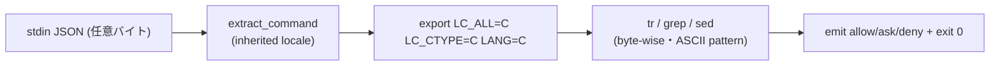

# 設計ノート
<!-- 正本: brainstorming skill -->

## 入力

- ブレインストーミング記録: `docs/specs/2026-07-18-iter73-locale-byte-sweep-brainstorm-record.md`
- 要件: なし（framework 内部 hardening・requirements gate は N/A 継続）
- 動機正本: iter72 F-CRIT-1（`docs/security-followups.md` SF-014 内・commit 90b4b61）／
  next_action（iter73 掃討方針・2026-07-18 ユーザー合意）

## 問題整理

- 背景: iter72 で marker.sh の locale 依存 grep を `LC_ALL=C`（関数 local）で byte-wise 化した。
  deny 側 moat フック（`check-destructive.sh`・`check-secrets.sh`）は agent 統制の Bash コマンド
  テキストを `tr`/`grep` で処理するが LC_ALL 設定ゼロ。同型の locale 依存が残存する。
- 判断が必要な論点:
  1. 実際に fail-open するか（機構と exploitability）→ **実証済み**（下記「実証結論」）。
  2. severity（next_action の HIGH 仮説の当否）→ **実証で hardening/Medium に格下げ**。
  3. スコープ（どのフックまで掃討するか）→ **実証で crash する 2 フックに限定**。
  4. 修正の配置（python3 抽出を C locale で壊さない）→ **抽出直後に export**。
- 制約条件:
  - control-plane（反ガミング moat）を触る＝review+qa+security 必須。
  - 「rushed control-plane 変更は新規バグ源」（SF 系の戒め）＝最小・漏れない・pin 付き。
  - フック契約: 常に JSON 判定を emit し exit 0（`docs/hook-failure-policy.md`）。
  - 脅威モデル（`security-followups.md` canonical 節）＝**LLM の事故的自己バイパス**。Bash 任意
    コマンド経路は「敷居を上げる層」（sandbox でない・SF-004 原理的限界）。

## 実証結論（2026-07-18・ローカル実測。CI/Linux GNU grep では grep 経路も加わる想定）

- **機構**: 不正 UTF-8 バイトを含む Bash コマンド → `extract_command` の grep fast-path が raw
  バイト保持の CMD を返す → `CMD_LOWER=$(...| tr '[:upper:]' '[:lower:]')`（または check-secrets
  の `CMD_LC`）の **`tr` が UTF-8 locale で `Illegal byte sequence` でクラッシュ** → `set -euo
  pipefail` で**フックが rc=1・出力なしで異常終了** → 破壊的 warning / シークレット deny が
  emit されず fail-open。BSD grep（macOS の `/usr/bin/grep`）自体は末尾バイトを取りこぼさない
  （MATCH 実測）ため、macOS では **crash が支配機構**。GNU grep（Linux）では iter72 同様の
  grep poison も併発しうる＝`LC_ALL=C` は両方を一括で封鎖する。
- **スコープ**: crash は `check-destructive.sh`・`check-secrets.sh` **のみ**で発生（実測 rc=1）。
  `check-runtime-state.sh`・`check-deploy-gate.sh` は python3 抽出でバイト→空 CMD（tr 不到達）
  または tr 前に BSD grep（バイト安全）を通り **crash しない**（byte-in-CMD で rc=0・`{}` 実測）
  ＝同型不成立。`post-bash.sh` は tr/grep=0＝非該当。
- **severity 格下げ根拠（過大評価回避）**:
  - valid 多バイト（日本語パス/メッセージ）は**発火しない**（実測）＝i18n の事故経路は無害。
  - 不正バイトの意図的挿入は**敵対的**＝SF-004（interpreter コード）と同クラスで脅威モデル外。
  - 不正バイト混入の事故経路は Linux の**非 UTF-8 ファイル名を明示引数にした破壊コマンド**
    （`rm -rf <badbyte-path>`）等に限定＝**narrow**（macOS 既定 FS は UTF-8 正規化で稀）。
  - crash→allow は「パース失敗時 allow」の**宣言済みポリシー**の帰結でもある。
  - よって「HIGH の exploitable fail-open」ではなく **hardening（crash 堅牢化＋iter72 一貫性）**。
- **fix の妥当性（それでも直す理由）**: (1) crash がフックの「常に判定を emit」契約に反し、かつ
  自前の raw-payload fail-safe fallback（check-destructive.sh:38-54）を迂回する。`LC_ALL=C` で tr が
  通れば byte 混入 `rm -rf` でも従来の判定（emit_ask）が正しく発火＝narrow だが実在の事故防止改善。
  (2) iter72 marker.sh と同型を残さない一貫性。(3) stderr ノイズ（`tr: Illegal byte sequence`）除去。

## 推奨アプローチ

- 採用方針: **各フックの `CMD=$(extract_command "$INPUT")` 直後に
  `export LC_ALL=C LC_CTYPE=C LANG=C` を 1 行追加**し、以降の raw-input fallback ブロックを含む
  全 tr/grep/sed を byte-wise 決定化する（アプローチ A）。
- 採用理由: 実証 footprint（2 フック・crash 支配）に対し最小で漏れがない。両フックは**抽出後に
  python3 を呼ばない**（実測）ため C locale 汚染が起きず、iter72 が関数 local に留めた懸念を
  「配置」で回避できる。iter72 の LC_ALL=C 方針と一貫。
- 検討した代替案と不採用理由:
  - B（tr/grep 個別 prefix・23+ 箇所）: 付け漏れリスク・差分肥大・control-plane 大量改変。
  - C（共有ヘルパー＋crash-safe trap）: blast radius 拡大・trap は control-plane 構造変更＝別テーマ
    の scope creep。crash-safe 契約の恒久化は将来候補として記録に留める。

## コンポーネント分解

- 分割方針: フック 2 本＋テスト。moat コアの挙動（判定ロジック）は**不変**、locale 決定化のみ additive。
- 各ユニットの責務:
  - **`hooks/check-destructive.sh`**: `INPUT=$(cat)`→`CMD=$(extract_command "$INPUT")` の直後に
    `export LC_ALL=C LC_CTYPE=C LANG=C` を追加（rationale コメント付き）。`[ -z "$CMD" ]` の
    raw-input fallback（tr 使用）・`CMD_LOWER` の tr・全 grep がこれで byte-wise。判定分岐は無改修。
  - **`hooks/check-secrets.sh`**: 同様に `CMD=$(extract_command "$INPUT")` 直後へ 1 行追加。以降の
    `RAW_LC`/`CMD_LC` の tr・Check 0-3 の全 grep・`git diff | tr | grep`・`find|basename|tr` が
    byte-wise。判定分岐は無改修。
  - **テスト（新規 or 既存拡張）**: 両フックの locale/byte 回帰 pin（下記テスト戦略）。

## インターフェース定義

- ユニット間の契約:
  - フック stdin → JSON payload（`tool_input.command`）。契約不変。
  - フック stdout → 判定 JSON（`permissionDecision`: allow/ask/deny）＋ exit 0。契約不変。
    **本 fix はこの契約を byte 混入入力でも守れるようにする**（現状は crash で契約違反）。
- 公開 API: なし（フック内部の locale 設定のみ）。emit_allow/emit_ask/emit_deny の IF 不変。

## データフロー / 構造

- 入力: `{"tool_name":"Bash","tool_input":{"command":"<任意バイト列>"}}`。
- 処理: extract_command（python3 or grep・**inherited locale のまま**＝UTF-8 fidelity 維持）
  → `export LC_ALL=C`（ここから byte-wise）→ tr 小文字化 / grep パターン照合（ASCII+literal
  パターンゆえ byte-wise が正）→ 判定。
- 出力: 従来と同一の allow/ask/deny JSON。byte 混入時に **crash せず**判定を返す。

## 依存関係

- 依存方向: フック → `hooks/lib/{safety,extract-input,emit,patterns,secrets-patterns}.sh`（不変）。
- 外部依存: `tr`/`grep`/`sed`/`git`/`find`（POSIX）。`LC_ALL=C` は POSIX 標準＝可搬。追加依存なし。
- **不変条件（pin 対象）**: 両フックは `export LC_ALL=C` 以降 **python3 を呼ばない**。将来 python3 を
  下流に足す場合は C locale の UTF-8 影響を再評価（設計コメントで警告）。

## エラーハンドリング

- 想定失敗（fix 前）: 不正バイト → tr crash → rc=1・出力なし → moat skip（fail-open・契約違反）。
- 対応（fix 後）: `LC_ALL=C` で tr が各バイトを 1 文字扱い＝crash せず小文字化 → 通常判定が走る。
  実破壊的/実シークレット対象は従来どおり ask/deny、無害コマンドは allow。
- エラー伝播の方針: フック契約（常に JSON emit・exit 0）を byte 混入でも維持。既存の
  AEGIS_SAFETY_FALLBACK（lib 欠落時 deny）・extract 失敗時の raw fail-safe は無改修で温存。

## テスト戦略

- 単体（新規 pin・両フック）:
  - **(a) crash 回帰**: fix 前は不正バイト混入コマンドで **rc≠0** を再現、fix 後は **rc=0＋JSON emit**。
    （iter72 の「pre-fix で bad 挙動を再現する非空 pin」流儀）。
  - **(b) moat 維持（byte 下）**: `rm -rf /realdir`＋0xFF → **ask**、`git add`＋実シークレット参照＋
    0xFF → **deny**（byte があっても判定が正しく出る）。
  - **(c) i18n 非退行**: valid 多バイト（`rm -rf ~/プロジェクト`→ask、`git add テスト/.env`→deny）が
    fix 後も維持。
  - **(d) 正常路非退行**: 既存 ASCII pin（destructive/secrets 全既存テスト）が全 green。
  - 実行 locale: **UTF-8 を明示設定して発火**（既存 50 pin が全 ASCII で見落とした iter72 の教訓＝
    テストは UTF-8 locale＋不正バイト/多バイト入力を必ず含める）。
- 結合: `tests/test_failure_policy.py` の宣言（parse-fail→allow）と非矛盾を確認。フック直接発火。
- エッジケース: バイト位置（先頭/中間/末尾）・複数バイト・valid 多バイトと不正バイトの混在。
  check-secrets の broad-stage / commit staged-diff 経路も byte 下で判定維持を確認。
- 手動確認: 実 clone で UTF-8 locale 実環境 E2E（qa フェーズ）。`check-runtime-state`/`deploy-gate`
  が非該当（crash しない）ことの再確認も qa で残す（掃討の完全性エビデンス）。

## 次のステップ

- [ ] 実装計画を作成する → `docs/plans/2026-07-18-iter73-locale-byte-sweep-implementation-plan.md`
- テンプレート名: `PLAN.template.md`
- 本設計ノートのパスを PLAN の「参照設計」に記載すること
- plan 後に grill-plan（標準フロー）→ implement（TDD RED-first・書く=opus）→ grill-code →
  review（1次4角度=opus→親verify=fable・盲検2次=fable）→ qa → security →（M ゆえ deploy skip）→
  ship（bump）→ docs → dev_ready_for_client。
<!-- exit-check: 全セクション記入・自己レビュー完了 → plan へ -->
