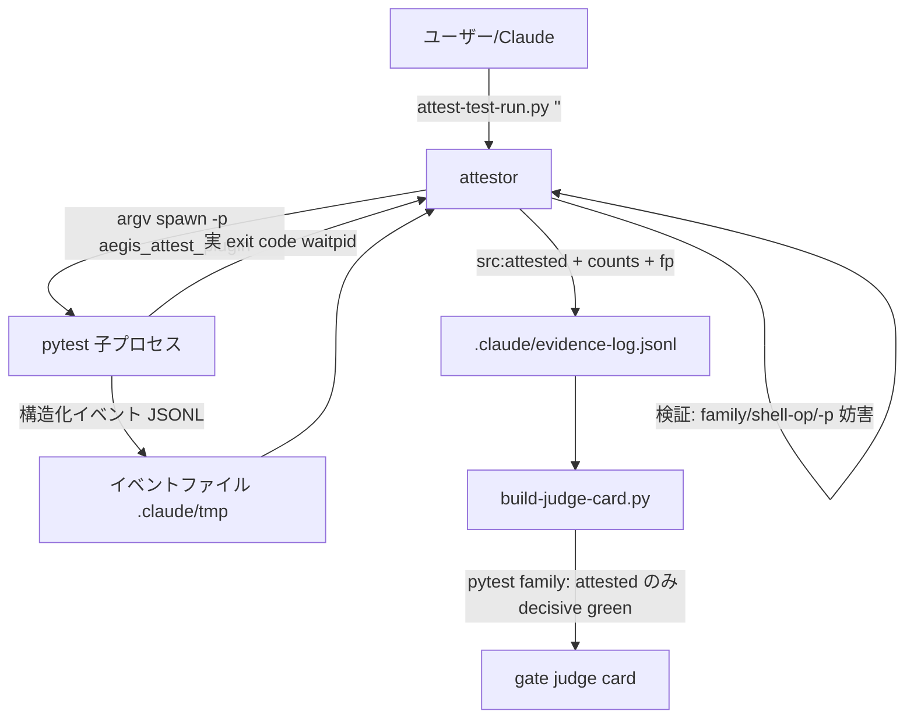

# 設計ノート — iter78 pytest execution attestation
<!-- 正本: brainstorming skill -->

## 入力

- ブレインストーミング記録: `docs/specs/2026-07-28-iter78-pytest-execution-attestation-brainstorm-record.md`
- 要件: `docs/full-review-2026-07-19-dual-codex-fable.md` §4.2/§5 行77、`docs/security-followups.md` SF-014/SF-022/SF-015

## 問題整理

- 背景: evidence 層の green 証明が全て出力テキスト解析（marker 6-stage）に依存。fake 出力・exit 洗浄・zero-run/all-skip・fail-token 語彙は denylist/出力 marker では原理的に塞ぎ切れない（SF-014/SF-022・LEARNINGS conf9）。
- 判断が必要な論点: (1) 証跡の取得機構、(2) judge の green 判定をどこまで attested に制限するか、(3) 残余天井の正直な線引き。
- 制約条件: 外部依存ゼロ（stdlib/pure-bash）、非 pytest エコシステムを壊さない（roadmap §6）、fail-closed 原則（評価不能は green 不能）、tamper 面の非拡大。

## 推奨アプローチ

- 採用方針: argv spawn＋pytest プラグインの構造化イベントで「実行され passed/failed/error のいずれか」を positive proof 化。`src:"attested"` を evidence-log の第3の writer とし、judge は pytest family の decisive green を attested のみに制限。
- 採用理由/代替案: brainstorm-record の A/B/C 参照。

## コンポーネント分解

- ユニット1 `scripts/attest-test-run.py`（新規・CLI・class=ask）: 検証→spawn→突合→記録の attestor 本体。
- ユニット2 `scripts/aegis_attest_plugin.py`(新規・import-only): pytest プラグイン。イベント JSONL 書出のみ（判定しない）。
- ユニット3 `scripts/build-judge-card.py`（改修）: src allowlist へ `attested` 追加＋pytest-family green 制限。
- ユニット4 `scripts/record-test-result.py`（改修）: pytest family を rc2 で attest へ誘導。
- 単一ソース: pytest family 判定は `hooks/lib/patterns.sh` の `AEGIS_TEST_IS_PYTEST_REGEX` を bash-source 経由で読む（judge の既存 loader と同方式・attestor/judge/record で共用）。

### アーキテクチャ図

## インターフェース定義

### attest-test-run.py

- CLI: `python3 scripts/attest-test-run.py [--root .] "<pytest コマンド文字列>"`（record と同じ単一文字列契約）。
- 検証（実行前・全て rc2/記録なし）:
  1. `AEGIS_TEST_IS_PYTEST_REGEX` 照合（読込不能＝fail-closed rc2。非 pytest → record を案内）。
  2. `shlex.split` 失敗／空 argv／`argv[0]` に `=`（env 代入）／シェル演算子トークン `&& || ; | &` → rc2（record と同一規約）。
  3. `-p` 引数（`-p<val>`/`-p <val>` 両形）で `no:` 系 disable または本プラグイン名の指定 → rc2（プラグイン注入の打ち消し禁止）。
- 実行: `subprocess.run(argv + ["-p", "aegis_attest_plugin"], shell=False, cwd=root, timeout=600, env=E)`。`E` は親環境＋`PYTHONPATH` 先頭に `scripts/` を前置＋`AEGIS_ATTEST_EVENT_PATH=<root>/.claude/tmp/attest-<pid>-<rand>.jsonl`（attestor が親ディレクトリ作成・事前に空生成）。子の stdout/stderr は**継承（パースしない）**。
- イベント突合（verdict）:
  - `sessionfinish` イベント欠落、`exitstatus != returncode`、`returncode==0 かつ failed+errors+collection_error>0`、イベント JSON 破損 → **rc2・記録なし**（attest 不成立・fail-closed）。
  - green: `returncode==0 ∧ executed>=1 ∧ failed==0 ∧ errors==0 ∧ collection_error==0` → `status:"ok"` で記録・rc0。
  - red: `returncode!=0` → `status:"fail"` で記録・rc1（fail-visible）。
  - zero-run: `returncode==0 ∧ executed==0`（all-skip / 収集0）→ rc2・記録なし。
- 記録スキーマ（evidence-log.jsonl 追記・既存 schema の上位互換）:
  `{"v":1,"ts":…,"src":"attested","cmd":"<ユーザーコマンド[:500]・注入 -p は含めない>","status":"ok|fail","payload_sha":"<イベントファイル bytes の sha256>","fp":<current_fingerprint>,"counts":{"executed":n,"passed":n,"failed":n,"skipped":n,"errors":n,"xfailed":n,"xpassed":n,"collection_errors":n},"exit":n}`
- 後処理: イベントファイルは記録後に削除（証跡は payload_sha とカウントで保持）。

### aegis_attest_plugin.py（pytest プラグイン）

- `AEGIS_ATTEST_EVENT_PATH` 未設定なら完全 no-op（誤 import 安全）。書込は追記・行単位 flush。
- フック: `pytest_collectreport`（failed → collection_error イベント）／`pytest_runtest_logreport`（phase/outcome/wasxfail を1行イベント）／`pytest_sessionfinish`（exitstatus）。
- プラグインは**計数しない**（イベントの忠実な記録のみ）。集計・判定は attestor 側に一元化。
- プラグイン内部例外は握って続行（テスト実行を壊さない）。イベント欠落は attestor 側で rc2 に倒れる＝**fail-closed 保証はプラグインでなく突合側**が持つ。

### カウント定義（attestor 側で集計）

- `executed` = **call phase の logreport を持つ distinct テスト数**（outcome 不問）。setup-skip は call を持たない＝除外。xfailed/xpassed は call を持つ＝算入 → SF-015（all-xfail 偽陰性）は attested 経路で解消。
- `passed`/`failed` = call phase の passed/failed。`errors` = setup/teardown phase の failed。`skipped` = skip 報告（wasxfail 除く）。`xfailed`/`xpassed` = wasxfail 付き。

### build-judge-card.py（read_test_result_detail の変更）

1. src allowlist: `{"manual","observed"}` → `{"manual","observed","attested"}`（`:334` の前方コメント通り・同一変更で writer を導入）。
2. **pytest-family green 制限**: 正規化済み cmd が `AEGIS_TEST_IS_PYTEST_REGEX` に一致し `src∈{"manual","observed"} ∧ status=="ok"` のエントリは **TRANSPARENT（skip）**＝green を証明できない（washed-green と同じ透明化・下に attested があればそれが決める）。`status=="fail"` は従来通り decidable red（fail-visible 維持）。
3. attested エントリ: fp 一致で status 通り decidable（manual と同格の trusted writer。counts は判定に使わず表示/監査用＝write 時に attestor が強制済み）。
4. `AEGIS_TEST_IS_PYTEST_REGEX` の読込失敗 → 既存 loader 群と同じく **'unverified' へ fail-closed**（緩い方へ落とさない）。
- 観測順序の整合: attest 実行自体の hook observed エントリは「attest-test-run.py Q」形＝runner 非該当（クォート span はマスク）→ scan 対象外。裸 pytest を直接走らせた observed 'ok' は transparent で下の attested に到達する＝**新しい green 経路は attest 一本**。

### record-test-result.py（変更）

- runner 照合通過後に family 判定を追加: pytest family → rc2「pytest は scripts/attest-test-run.py を使ってください」（green/red とも。red 記録も attest 側が担う＝経路一本化）。非 pytest は完全に従来通り（marker 経路・文書化残余）。

### scripts-manifest.tsv

- `scripts/attest-test-run.py` → `ask`（record と同じ「引数コマンド実行ガジェット」класс・auto-allow 禁止）。
- `scripts/aegis_attest_plugin.py` → `import-only`。

## データフロー / 構造

- 入力: pytest コマンド文字列（ユーザー/qa 手順から）。
- 処理: 検証 → argv spawn（plugin 注入）→ イベント収集 → exit/イベント突合 → verdict。
- 出力: evidence-log.jsonl の attested エントリ（または rc2 拒否）。judge が gate 判定時に消費。

## エラー処理

- 方針: **評価不能＝green 不能**（rc2・記録なし）。失敗は fail-visible（red 記録 rc1）。プラグイン死・イベント破損・exit 不整合・timeout は全て rc2 側。
- 誤用（非 pytest・シェル演算子・-p 妨害）は実行前 rc2＋stderr 誘導（record の usage 文体を踏襲）。

## 依存関係

- 追加依存なし（python3 stdlib＋既存 patterns.sh/fingerprint 基盤のみ）。pytest はターゲット repo が既に持つ前提（attestor は pytest family コマンドのみ受ける）。

## テスト戦略

1. **RED differential（旧緑/新赤・ship 条件）**: (a) observed pytest 'ok'（marker_verified:true・fp 一致）だけの log → 旧: green ／ 新: unverified。(b) manual pytest → record が rc2。
2. **attest e2e**: 小型実 suite で green 記録→judge green／failing suite → red／collection error → red（collection_errors≥1）。
3. **構造 pin（本命）**: 出力偽造 suite（`===== 999 passed =====` を print して実は fail）→ attested red（出力非依存の実証）。`pytest; true` → rc2。`-p no:aegis_attest_plugin` → rc2。
4. **positive proof**: all-skip → rc2（executed=0）／all-xfail → green（SF-015 解消 pin）／collect-only 相当（収集のみ）→ rc2。
5. **fail-closed**: conftest がイベントファイルを破壊 → rc2（in-process 妨害は green 側に倒れない実証）／exitstatus 突合不一致 → rc2／fp stale attested → unverified。
6. **非弱体化**: 既存 full suite green 維持。judge の pytest green 制限で契約変更となる既存 pin は**削除せず契約更新**として1件ずつ列挙・書き替え（plan で列挙）。
7. **残余文書化 pin**: 手書き attested エントリが status で決まる（manual と同一の pre-existing 天井）ことを記録する documenting test（TestSkipSuiteResidual の流儀）。

## 残余リスク（受容・文書化）

- in-process 妨害（conftest・fake pytest バイナリ）と evidence-log 手書き偽造は pre-existing 天井と同クラス・非拡大（brainstorm-record「残余天井」参照）。fail-closed 側に倒れることのみ pin で保証。
- 非 pytest ランナーは marker 経路のまま（roadmap 行78 以降で扱う）。

## 版数・ゲート routing

- MINOR: v1.31.4 → v1.32.0（新 CLI＋judge 挙動の公開契約変更）。
- task_size=M（src 4 ファイル: 新規2＋judge/record）→ M routing: implement→review→qa→security→ship→docs（deploy skip）。
